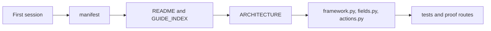
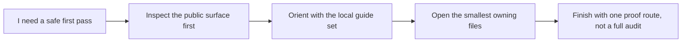

# First Session Guide

<!-- page-maps:start -->
## Guide Maps

<!-- page-maps:end -->

Use this guide when the capstone is new to you and the root directory already contains
more routes than your first session can support. The goal is not to read every local
guide. The goal is to leave the first session understanding the runtime shape, the owning
files, and the next honest proof route.

## First-session route

1. Run `make manifest`.
2. Read [README.md](../README.md).
3. Read [GUIDE_INDEX.md](GUIDE_INDEX.md).
4. Read [ARCHITECTURE.md](ARCHITECTURE.md).
5. Open `src/incident_plugins/framework.py`, then `fields.py`, then `actions.py`.
6. Read `tests/test_registry.py` and `tests/test_fields.py`.
7. Stop there unless your current question clearly requires invocation or CLI detail.

## What each step is supposed to answer

| Step | Main answer |
| --- | --- |
| `make manifest` | what the runtime exposes publicly without invoking plugin behavior |
| `README.md` | what this repository is for and which commands matter |
| `GUIDE_INDEX.md` | which local guide to open next for a concrete question |
| `ARCHITECTURE.md` | which file owns each mechanism and why |
| `framework.py`, `fields.py`, `actions.py` | where definition-time, attribute, and callable behavior actually live |
| `test_registry.py`, `test_fields.py` | what proof already exists for class creation and descriptor ownership |

## Good first-session stopping points

Stop after the first session when you can answer:

- what the runtime exports without invocation
- which file owns registration
- which file owns field behavior
- which file owns action wrapping
- which proof file you would open first for registration or field questions

If you cannot answer those yet, keep rereading the route above instead of branching into
extra guides.

## What not to do on the first session

- do not start with `make proof` unless you already know the local guide set
- do not open every guide file in alphabetical order
- do not start with `plugins.py` before the ownership model is clear
- do not use one passing command as proof that you understand the architecture

## Best next routes after the first session

- Read [COMMAND_GUIDE.md](COMMAND_GUIDE.md) if your next question is command selection.
- Read [GUIDE_INDEX.md](GUIDE_INDEX.md) if your next question is which local guide matches the pressure.
- Read [SOURCE_GUIDE.md](SOURCE_GUIDE.md) if your next question is where one owning symbol lives.
- Read [TEST_GUIDE.md](TEST_GUIDE.md) if your next question is which proof file should fail first.
