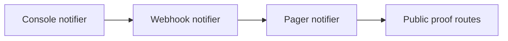

# Plugin Catalog

<!-- page-maps:start -->
## Guide Maps

<!-- page-maps:end -->

Use this guide when the capstone's concrete plugins still feel like implementation filler.
The goal is to show why each built-in adapter exists and what metaprogramming pressure it
helps prove.

## Built-in plugins

| Plugin | Why it exists | Best proof surface |
| --- | --- | --- |
| `console` | proves simple string rendering with defaults, choices, and boolean coercion | `make demo`, `plugin delivery console`, and field tests |
| `webhook` | proves required fields, numeric coercion, and deterministic structured payloads | `plugin delivery webhook` and runtime tests |
| `pager` | proves multiple actions, nested action history, and concrete JSON preview output | `make trace`, `plugin delivery pager`, and runtime tests |

## What to compare across plugins

- which fields are required versus defaulted
- which actions return strings versus structured dictionaries
- which plugin is best for watching wrapper history become visible
- which plugin is best for reviewing field coercion pressure

## Best companion guides

- read [PACKAGE_GUIDE.md](PACKAGE_GUIDE.md) when you want the file placement of the plugin layer
- read [SCENARIO_GUIDE.md](SCENARIO_GUIDE.md) when you want the shipped demo and trace examples
- read [COMMAND_GUIDE.md](COMMAND_GUIDE.md) when you want the smallest command for one plugin
