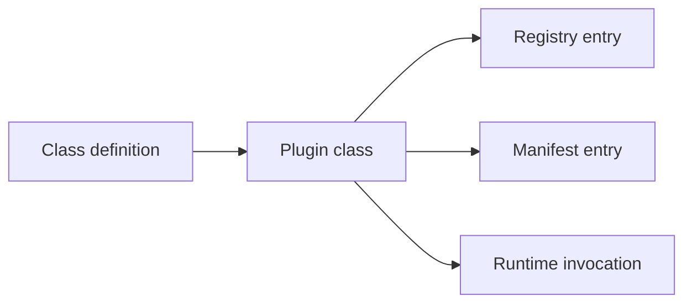
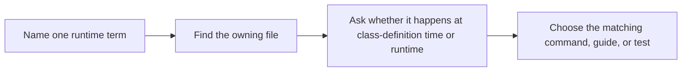

# Plugin Runtime Guide

<!-- page-maps:start -->
## Guide Maps

<!-- page-maps:end -->

Use this guide when the capstone feels technically correct but the vocabulary is still
too implicit. The goal is to make the runtime model explicit before you reason about
metaclasses, descriptors, wrappers, or CLI routes.

## Start from time, not from mechanism names

If the course feels abstract, ask this first:

- class-definition time: what gets collected, generated, or registered before instances exist?
- runtime: what happens only after configuration is provided and an action is invoked?
- inspection time: what can you see publicly without running plugin behavior?

Then use the matching route:

- run `make registry` or `make signatures` for class-definition questions
- run `make trace` for runtime questions
- run `make manifest` for inspection-time questions

## Core terms

| Term | Meaning in this capstone | Owning surface |
| --- | --- | --- |
| plugin group | the stable registry bucket for related plugin classes | `framework.py` |
| plugin name | the stable public name used by registry, manifest, and CLI routes | `framework.py` and `plugins.py` |
| field | a descriptor-backed configuration contract declared on the class body | `fields.py` |
| action | a wrapped plugin method with preserved signature and recorded metadata | `actions.py` |
| registry | the deterministic mapping from group and plugin name to concrete class | `framework.py` |
| manifest | observational metadata exposing fields, actions, docs, and plugin identity | `framework.py` |
| invocation trace | the runtime surface that shows configuration, result, and action history together | `cli.py` and `actions.py` |

## What happens when

| Time | What happens |
| --- | --- |
| class-definition time | fields and actions are collected, signatures are generated, and plugins are registered |
| runtime | instances are created, configuration is coerced, actions are invoked, and history is recorded |
| inspection time | manifest and registry output are rendered without invoking plugin actions |

## Questions this guide should settle

- which behavior belongs to the metaclass rather than the descriptors
- which behavior belongs to the action wrapper rather than the CLI
- which public outputs are observational metadata rather than invocation proof
- which plugin names and groups are stable enough to review from the public surface

## Good stopping point

Stop with this guide once you can answer:

- what exists before any instance is created
- what only appears after one action is invoked
- what the public CLI can reveal without invoking plugin work

## Best companion guides

- read [ARCHITECTURE.md](ARCHITECTURE.md) when the file boundaries matter more than the terms
- read [TOUR.md](TOUR.md) when you want the same model turned into a review route
- read [PROOF_GUIDE.md](PROOF_GUIDE.md) when the terms are clear and you need executable evidence
