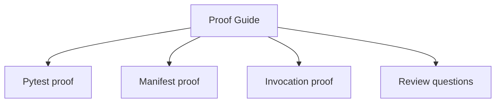
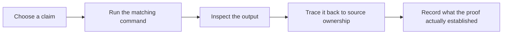

# Proof Guide

<!-- page-maps:start -->
## Guide Maps




<!-- page-maps:end -->

This guide keeps the capstone honest by tying each public claim to one repeatable proof path.

## Start by claim

| If the claim is... | Start with | Escalate with |
| --- | --- | --- |
| the runtime surface is observational | `make manifest` or `make registry` | `make inspect` |
| wrapper behavior stays visible | `make trace` | `tests/test_runtime.py` |
| descriptor fields own validation | `make field` | `tests/test_fields.py` |
| registration stays deterministic | `make registry` | `tests/test_registry.py` |
| the full review surface still agrees with tests | `make verify-report` | `make proof` |

## Strongest local proof

Run:

```bash
make confirm
```

This runs the regression suite proving field validation, registry determinism, manifest
export, and runtime invocation behavior.

## Saved review routes

- `make inspect` writes the learner-facing inspection bundle.
- `make tour` writes the learner-facing walkthrough bundle.
- `make verify-report` writes executable proof together with public-surface evidence.

## Public-surface proof

Run the public proof surface:

```bash
make proof
```

Or run the CLI pieces individually:

```bash
make manifest
make registry
make demo
make trace
```

These commands prove that the runtime shape and invocation path are inspectable from the
public surface without opening private internals first.

## Smallest honest routes

- Use `manifest` before `inspect` when one public schema question is enough.
- Use `trace` before `verify-report` when one invocation route is enough.
- Use `confirm` before `proof` when the question is executable confidence rather than published review output.

## Honest distinctions

- `inspect` proves what the runtime exposes publicly before invocation.
- `tour` proves that a human can follow one complete public review route.
- `verify-report` proves that executable tests and public-surface evidence agree in one saved bundle.
- `confirm` proves the strongest local regression surface.
- `proof` publishes the full learner-facing review route.

## Read the proof route by module stage

- Observation modules: inspect `manifest` and `registry` output before running actions.
- Decorator modules: compare `demo`, `trace`, and runtime-test expectations.
- Descriptor modules: pair `confirm` with `tests/test_fields.py`.
- Metaclass module: pair `registry` output with `tests/test_registry.py`.
- Governance and mastery: use `inspect`, `tour`, and `verify-report` as the final human review surface.

Use [REGISTRY_GUIDE.md](REGISTRY_GUIDE.md) when the metaclass proof question is mainly
about deterministic registration and duplicate handling.

Use [MANIFEST_GUIDE.md](MANIFEST_GUIDE.md) when the proof question is mainly about
observational export rather than registration or invocation.

## Review questions

- Which proof demonstrates definition-time behavior?
- Which proof demonstrates preserved callable metadata?
- Which proof demonstrates that the manifest stays observational rather than operational?

Use [TRACE_GUIDE.md](TRACE_GUIDE.md) when the key proof question is really about wrapper
history and visible invocation metadata.
