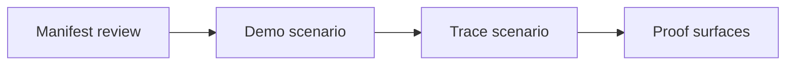
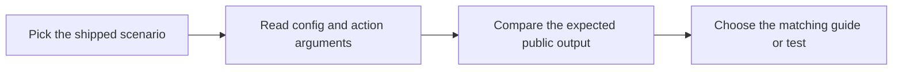

# Scenario Guide

<!-- page-maps:start -->
## Guide Maps

<!-- page-maps:end -->

Use this guide when the capstone's built-in CLI examples feel useful but underexplained.
The goal is to keep the shipped scenarios stable enough to teach from and test against.

## Demo scenario

| Surface | Value |
| --- | --- |
| group | `delivery` |
| plugin | `console` |
| action | `deliver` |
| config | `prefix=[ops]`, `uppercase_severity=true` |
| arguments | `title=CPU high`, `severity=warning`, `summary=node-1 crossed 90%` |
| expected result | `[ops] WARNING CPU high: node-1 crossed 90%` |

## Trace scenario

| Surface | Value |
| --- | --- |
| group | `delivery` |
| plugin | `pager` |
| action | `preview` |
| config | `service=core`, `routing_key=sev1` |
| arguments | `title=Queue lag`, `severity=critical`, `summary=worker backlog growing` |
| expected evidence | configuration, recorded action history, and JSON preview result |

## Best companion guides

- read [WALKTHROUGH_GUIDE.md](WALKTHROUGH_GUIDE.md) when you want the same scenarios as a staged review route
- read [COMMAND_GUIDE.md](COMMAND_GUIDE.md) when you want the smallest command that exposes the scenario
- read [TEST_GUIDE.md](TEST_GUIDE.md) when you want the proof surface for those exact scenarios
