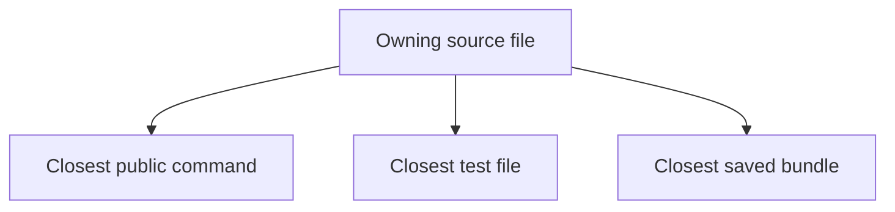
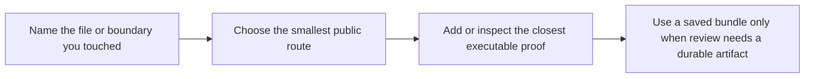

# Source To Proof Map

<!-- page-maps:start -->
## Guide Maps

<!-- page-maps:end -->

Use this guide when you know which source file owns the behavior but still need the
fastest honest route to prove that behavior. The goal is to stop proof from drifting away
from ownership.

## File to proof map

| Source file | Best public route | Best executable proof | Best saved review route |
| --- | --- | --- | --- |
| `src/incident_plugins/framework.py` | `make manifest`, `make registry`, `make signatures` | `tests/test_registry.py` and `tests/test_runtime.py` | `make inspect` or `make verify-report` |
| `src/incident_plugins/fields.py` | `make field` and `make plugin` | `tests/test_fields.py` | `make inspect` |
| `src/incident_plugins/actions.py` | `make action`, `make trace`, and `make signatures` | `tests/test_runtime.py` and `tests/test_cli.py` | `make tour` or `make verify-report` |
| `src/incident_plugins/plugins.py` | `make plugin`, `make demo`, and `make trace` | `tests/test_runtime.py` | `make tour` |
| `src/incident_plugins/cli.py` | `make manifest`, `make registry`, `make trace`, and `make demo` | `tests/test_cli.py` | `make inspect`, `make tour`, or `make verify-report` |
| `scripts/write_bundle_manifest.py` | `make inspect`, `make tour`, or `make verify-report` | `tests/test_bundle_manifest.py` | the matching bundle directory under `artifacts/` |

## How to use the map well

1. Start from the owning file, not from the broadest command.
2. Choose the smallest public route that exposes the changed behavior.
3. Use the closest test file to make the claim executable.
4. Use a saved bundle only when another reviewer needs a durable artifact.

## Common proof mistakes this prevents

- changing `framework.py` and only running `make demo`
- changing `actions.py` and forgetting that signature visibility is part of the contract
- changing `fields.py` and proving only one plugin instead of field behavior itself
- changing `cli.py` without checking the public command path directly

## Best companion guides

- `PACKAGE_GUIDE.md`
- `TEST_GUIDE.md`
- `COMMAND_GUIDE.md`
- `PROOF_GUIDE.md`
