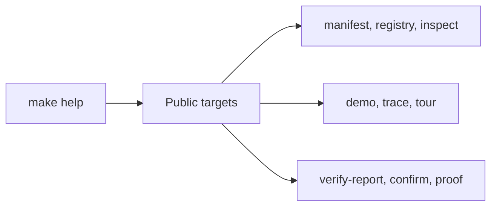
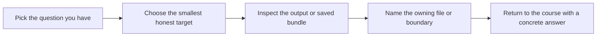

# Target Guide

<!-- page-maps:start -->
## Guide Maps

<!-- page-maps:end -->

Use this guide when `make help` shows several commands but the right one is still not
obvious. The goal is not target memorization. The goal is choosing the smallest honest
route for the claim you need to check.

## Start here when two commands feel too similar

- Use this page after [COMMAND_GUIDE.md](COMMAND_GUIDE.md), not before it.
- Stay here when you are deciding between two plausible targets.
- Leave once one distinction settles the choice.

## Stable targets

| Target | What it is for |
| --- | --- |
| `manifest` | inspect the observable plugin schema without execution |
| `plugin` | inspect one concrete plugin contract without invocation |
| `field` | inspect one concrete field contract without invocation |
| `action` | inspect one concrete action contract without invocation |
| `registry` | inspect the registered plugins without opening private internals |
| `signatures` | inspect generated constructor and action signatures without invocation |
| `demo` | invoke one realistic delivery action |
| `trace` | inspect one invocation together with configuration and action history |
| `inspect` | build the saved learner-facing inspection bundle |
| `tour` | build the saved walkthrough bundle |
| `verify-report` | build the saved executable verification report |
| `confirm` | run the strongest local confirmation route |
| `proof` | build the published learner-facing review route |

## Fast target selection

### If the question is "what does the runtime publicly expose?"

Use:

* `make manifest`
* `make plugin`
* `make field`
* `make action`
* `make registry`
* `make signatures`

### If the question is "what happens when one action is invoked?"

Use:

* `make demo`
* `make trace`

### If the question is "what can I review later without rerunning commands?"

Use:

* `make inspect`
* `make tour`
* `make verify-report`

### If the question is "what is the strongest local proof?"

Use:

* `make confirm`
* `make proof`

## The confusing pairs

Use this section when the problem is not "what commands exist?" but "which of these two is the honest next move?"

- `manifest` versus `registry`
  `manifest` explains schema and action metadata; `registry` explains which plugins are currently registered.
- `manifest` versus `plugin`
  `manifest` shows the whole exported group; `plugin` lets you inspect one concrete plugin contract in isolation.
- `plugin` versus `field`
  `plugin` keeps fields and actions together; `field` isolates one descriptor-backed public contract.
- `field` versus `action`
  `field` isolates descriptor-backed configuration; `action` isolates decorator-backed callable metadata.
- `registry` versus `signatures`
  `registry` proves which plugins exist; `signatures` proves which generated call shapes they expose.
- `demo` versus `trace`
  `demo` shows one result; `trace` shows result, configuration, and recorded action history together.
- `confirm` versus `proof`
  `confirm` is the strongest local confirmation route; `proof` publishes the full learner-facing review route.

## Default choices when unsure

- Choose `manifest` before `registry`.
- Choose `field` or `action` before `plugin` when one contract is the real pressure.
- Choose `trace` before `demo` when metadata or history might matter.
- Choose `inspect` before `tour` when the question is still mainly about ownership.
- Choose `confirm` before `proof` when a human-facing published bundle is not required.

## Best companion guides

Read these with the target guide:

* `PACKAGE_GUIDE.md`
* `TEST_GUIDE.md`
* `WALKTHROUGH_GUIDE.md`
* `PROOF_GUIDE.md`
* `BUNDLE_GUIDE.md`
* `SCENARIO_SELECTION_GUIDE.md`
* `SOURCE_GUIDE.md`
