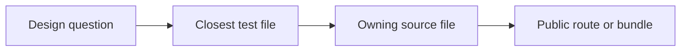
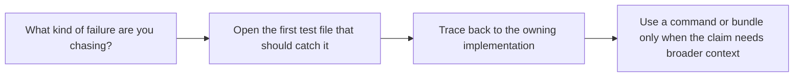

# Test Reading Map

<!-- page-maps:start -->
## Guide Maps

<!-- page-maps:end -->

Use this guide when you already know the kind of runtime claim or failure you are chasing
but do not want to browse the whole test suite to find the right proof surface.

## Question to test map

| If the question is about... | Read this test file first | Then open |
| --- | --- | --- |
| registration order, duplicate protection, or manifest shape rooted in class creation | `tests/test_registry.py` | `framework.py` and `COMMAND_GUIDE.md` |
| field defaults, coercion, required values, or per-instance descriptor storage | `tests/test_fields.py` | `fields.py` and `FIELD_GUIDE.md` |
| action history, generated constructors, or one concrete plugin invocation path | `tests/test_runtime.py` | `actions.py`, `framework.py`, and `plugins.py` |
| CLI behavior for manifest, registry, invoke, or trace routes | `tests/test_cli.py` | `cli.py` and `COMMAND_GUIDE.md` |
| saved bundle inventory and artifact manifests | `tests/test_bundle_manifest.py` | `scripts/write_bundle_manifest.py` and `BUNDLE_MANIFEST_GUIDE.md` |

## Failure-first reading order

Use this when you are debugging or reviewing a change:

1. Name the behavior that should fail first.
2. Open the matching test file from the table above.
3. Read the source file the failing test is meant to protect.
4. Only then expand into broader bundle or tour routes.

## Good review questions

- Which test is closest to the boundary that owns this behavior?
- Which test is only indirect evidence and should not be my first stop?
- If this test passed, what stronger claim would still remain unproven?

## Best companion guides

- `TEST_GUIDE.md`
- `SOURCE_TO_PROOF_MAP.md`
- `COMMAND_GUIDE.md`
- `PROOF_GUIDE.md`
