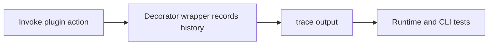
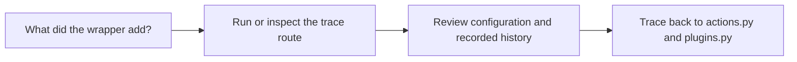

# Trace Guide

<!-- page-maps:start -->
## Guide Maps

<!-- page-maps:end -->

Use this guide when the capstone's trace output feels useful but under-interpreted. The
goal is to show exactly what the wrapper contributes and what it leaves alone.

## What trace proves

- plugin configuration is visible after descriptor coercion
- action history records which wrapped actions ran and which arguments they saw
- wrapper behavior can stay visible without hiding the underlying plugin result
- nested action calls, such as `preview()` calling `deliver()`, leave an ordered trail

## Best shipped trace scenario

- group: `delivery`
- plugin: `pager`
- action: `preview`
- why it matters: it exercises nested action recording and produces a concrete JSON preview

## Best companion guides

- read [EXTENSION_GUIDE.md](EXTENSION_GUIDE.md) for the fixed trace inputs
- read [TEST_GUIDE.md](TEST_GUIDE.md) when you want the closest proof file
- read [DESIGN_BOUNDARIES.md](DESIGN_BOUNDARIES.md) when the wrapper contract itself is still fuzzy
- read [PACKAGE_GUIDE.md](PACKAGE_GUIDE.md) when you want to understand why `pager` is the best trace example
