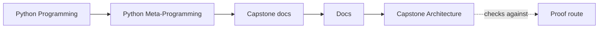
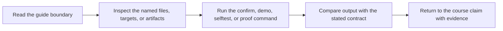

# Capstone Architecture

<!-- page-maps:start -->
## Guide Maps

<!-- page-maps:end -->

This capstone is intentionally small, but its architecture is strict. Each file owns one
layer of the runtime so you can see where class-definition behavior ends and runtime
behavior begins.

## Architectural boundaries

### `framework.py`

Owns class creation, generated constructor signatures, plugin registration, manifest export,
and the public invocation helpers.

### `fields.py`

Owns descriptor-backed configuration semantics and field metadata.

### `actions.py`

Owns action wrapping, signature preservation, and invocation-history recording.

### `plugins.py`

Owns concrete delivery adapters that make the abstractions tangible.

## Design rules

- manifest export must not execute plugin actions
- registration must be deterministic and resettable in tests
- field validation must happen where attribute ownership is explicit
- action wrapping must preserve the function shape visible to tooling

## Runtime model by time

| Time | What happens | Owning surface |
| --- | --- | --- |
| class-definition time | fields and actions are collected, signatures are generated, and plugins are registered | `framework.py` and `fields.py` |
| runtime | instances are created, configuration is coerced, actions are invoked, and history is recorded | `plugins.py`, `fields.py`, and `actions.py` |
| inspection time | manifest and registry output are rendered without invoking plugin actions | `framework.py` and `cli.py` |

## Built-in adapters keep the framework honest

| Plugin | Why it exists | Best proof surface |
| --- | --- | --- |
| `console` | proves string rendering with defaults, choices, and boolean coercion | `make demo`, `make plugin`, and field tests |
| `webhook` | proves required fields, numeric coercion, and deterministic structured payloads | `make plugin` and runtime tests |
| `pager` | proves multiple actions, nested action history, and JSON preview output | `make trace`, `make plugin`, and runtime tests |

## Why this architecture is pedagogic

The files are separated by mechanism rather than by framework convention alone. That
lets you ask, file by file, which behavior belongs to a field, a wrapper, a metaclass,
or ordinary runtime code.

## Best review routes for architecture questions

- Use `make inspect` when you need the public observable surface before opening source.
- Use `make tour` when you need the narrative route from inspection to invocation.
- Use `make verify-report` when you need saved executable evidence alongside that route.
- Use `EXTENSION_GUIDE.md` when the architecture question is really about change placement.
- Use `DESIGN_BOUNDARIES.md` when the architecture question is specifically which mechanism should own a new behavior.
- Use `PACKAGE_GUIDE.md` when the main confusion is the runtime vocabulary, timing model, or exact file route itself.
