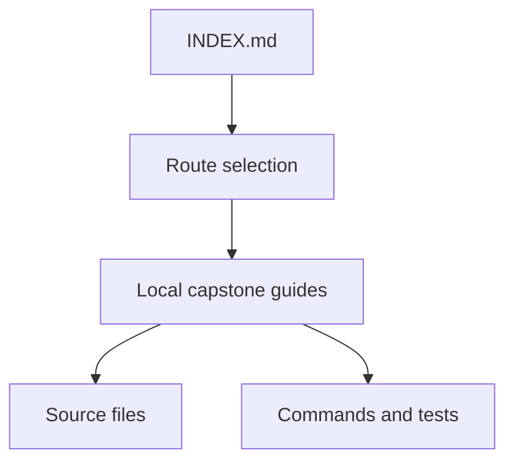
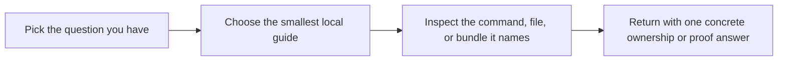

# Python Metaprogramming Capstone Docs

<!-- page-maps:start -->
## Guide Maps

<!-- page-maps:end -->

Use this page when the capstone root shows many guide files and you need one durable
starting point. It combines the first-session route with the guide index so the doc set
has one stable entry hub instead of two overlapping arrival pages.

## First honest pass

1. Run `make manifest`.
2. Read [README.md](../README.md).
3. Read [ARCHITECTURE.md](architecture.md).
4. Read [DESIGN_BOUNDARIES.md](design-boundaries.md).
5. Open `src/incident_plugins/framework.py`, then `fields.py`, then `actions.py`.
6. Read `tests/test_registry.py` and `tests/test_fields.py`.
7. Stop there unless your current question clearly requires invocation or CLI detail.

## What the first pass should settle

| Step | Main answer |
| --- | --- |
| `make manifest` | what the runtime exposes publicly without invoking plugin behavior |
| `README.md` | what this repository is for and which commands matter |
| `ARCHITECTURE.md` | which file owns each mechanism and why |
| `DESIGN_BOUNDARIES.md` | how definition-time, attribute-time, and invocation-time behavior differ |
| `framework.py`, `fields.py`, `actions.py` | where registration, field behavior, and action wrapping actually live |
| `test_registry.py`, `test_fields.py` | what proof already exists for class creation and descriptor ownership |

## Start here by question

### "What is this project, and how should I enter it?"

- [README.md](../README.md)
- [INDEX.md](index.md)
- [DESIGN_BOUNDARIES.md](design-boundaries.md)
- [ARCHITECTURE.md](architecture.md)

### "Which file owns which mechanism?"

- [ARCHITECTURE.md](architecture.md)
- [DESIGN_BOUNDARIES.md](design-boundaries.md)
- [PACKAGE_GUIDE.md](package-guide.md)

### "Which command should I run first?"

- [COMMAND_GUIDE.md](command-guide.md)
- [README.md](../README.md)

### "How do I inspect the public runtime shape?"

- [COMMAND_GUIDE.md](command-guide.md)
- [PROOF_GUIDE.md](proof-guide.md)

### "How do wrappers, fields, and constructors work?"

- [DESIGN_BOUNDARIES.md](design-boundaries.md)
- [PACKAGE_GUIDE.md](package-guide.md)

### "How do I review or extend the project safely?"

- [PROOF_GUIDE.md](proof-guide.md)
- [TEST_GUIDE.md](test-guide.md)
- [EXTENSION_GUIDE.md](extension-guide.md)

### "How do I read the saved review bundles?"

- [WALKTHROUGH_GUIDE.md](walkthrough-guide.md)
- [TOUR.md](tour.md)
- [PROOF_GUIDE.md](proof-guide.md)

## Escalation rule

Use the smallest guide that answers the current question, then stop.

- Move to source files only after the guide names the owning file.
- Move to tests only after the guide names the claim that still needs proof.
- Move to saved bundles only when another reviewer needs a durable artifact.

## Good stopping point

Stop after the first pass when you can answer:

- what the runtime exports without invocation
- which file owns registration
- which file owns field behavior
- which file owns action wrapping
- which proof file you would open first for registration or field questions
