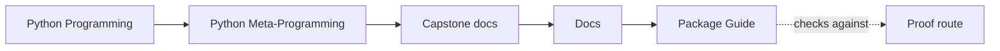
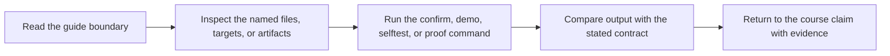

# Package Guide

<!-- page-maps:start -->
## Guide Maps

<!-- page-maps:end -->

Use this guide when the capstone still feels like a pile of Python hooks instead of a
system with named responsibilities. The goal is to know which file owns a kind of
metaprogramming pressure before you start chasing call stacks.

## Recommended reading order

1. `src/incident_plugins/framework.py`
2. `src/incident_plugins/fields.py`
3. `src/incident_plugins/actions.py`
4. `src/incident_plugins/plugins.py`
5. `src/incident_plugins/cli.py`
6. `tests/`

That route keeps definition-time authority first, attribute contracts second, wrapper
discipline third, concrete plugin behavior fourth, and proof surfaces last.

## Package responsibilities

| Surface | What it owns | What it should not own |
| --- | --- | --- |
| `framework.py` | metaclass registration, plugin construction, manifest export, and public runtime helpers | field coercion details or concrete delivery behavior |
| `fields.py` | descriptor-backed validation, coercion, and schema metadata | registry policy or action-history behavior |
| `actions.py` | action decorator metadata, signature preservation, and invocation recording | plugin registration or field storage |
| `plugins.py` | concrete incident-delivery plugins and realistic adapter behavior | framework-wide registry policy |
| `cli.py` | public inspection and invocation commands | hidden business logic not available from the runtime helpers |
| `tests/` | executable proof for import-time, class-definition-time, and invocation behavior | undocumented design authority |

## Best questions by file

- Open `framework.py` when you need to know what happens at class-definition time.
- Open `fields.py` when you need to know who validates configuration and when.
- Open `actions.py` when you need to prove that wrappers keep signatures and history visible.
- Open `plugins.py` when you need the concrete behavior that keeps the framework honest.
- Open `cli.py` when you need to inspect the public surface without importing private internals yourself.

Read [DESIGN_BOUNDARIES.md](design-boundaries.md) when the metaclass, descriptor, and
generated-constructor boundaries still need a sequence view before the file-by-file route.

Read [EXTENSION_GUIDE.md](extension-guide.md) when the framework is clear but the concrete
adapter differences or next change placement still need a purpose-driven explanation.

Read [COMMAND_GUIDE.md](command-guide.md) when the question is no longer only
internal ownership, but what the package intentionally exports.

## Best class and function route

| Question | Open this first | Then inspect |
| --- | --- | --- |
| How are plugin classes registered? | `framework.py` | `PluginMeta.__new__`, `_register_plugin()`, `PluginMeta.registry()` |
| How is the plugin constructor generated? | `framework.py` | `_build_signature()`, `_build_init()` |
| How are configuration values validated and stored? | `fields.py` | `Field`, `StringField`, `ChoiceField`, `Field.initialize()` |
| How are action signatures preserved and history recorded? | `actions.py` | `action()`, `ActionSpec.manifest()` |
| What concrete adapters make the framework honest? | `plugins.py` | `ConsoleNotifier`, `WebhookNotifier`, `PagerNotifier` |
| Which public commands expose the runtime? | `cli.py` | `_build_parser()` and the `_handle_*` functions |
| Which executable proof backs this claim? | `tests/` | `test_registry.py`, `test_fields.py`, `test_cli.py`, `test_runtime.py` |

## Concrete review scenarios

| Scenario | Best route | What it teaches |
| --- | --- | --- |
| inspect the public shape before invocation | `make manifest`, `make registry`, `make plugin` | what exists before runtime work starts |
| inspect generated call shapes | `make signatures` | how declared fields become visible constructors and action shapes |
| inspect one concrete action | `make demo` or `make trace` | how one built-in adapter keeps the framework honest |
| inspect one saved review bundle | `make inspect`, `make tour`, or `make verify-report` | how ownership and proof surfaces stay durable for later review |

## What this guide prevents

- starting in concrete plugins and mistaking them for the framework contract
- burying descriptor rules inside metaclass machinery
- treating the CLI as if it were the runtime source of truth
- reading tests before you know which file is supposed to own the behavior
