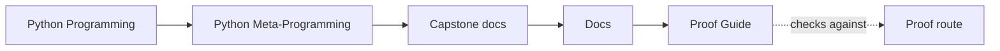
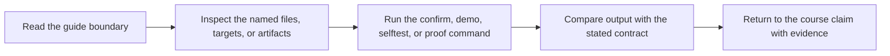

# Proof Guide

<!-- page-maps:start -->
## Guide Maps




<!-- page-maps:end -->

This guide keeps the capstone honest by tying each public claim to one repeatable proof path.

## Start by claim

| If the claim is... | Start with | Escalate with |
| --- | --- | --- |
| the runtime surface is observational | `make manifest` or `make registry` | `make inspect` |
| wrapper behavior stays visible | `make trace` | `tests/test_runtime.py` |
| descriptor fields own validation | `make field` | `tests/test_fields.py` |
| registration stays deterministic | `make registry` | `tests/test_registry.py` |
| the full review surface still agrees with tests | `make verify-report` | `make proof` |

## Strongest local proof

Run:

```bash
make confirm
```

This runs the regression suite proving field validation, registry determinism, manifest
export, and runtime invocation behavior.

## Saved review routes

- `make inspect` writes the guided inspection bundle.
- `make tour` writes the guided walkthrough bundle.
- `make verify-report` writes executable proof together with public-surface evidence.

## Choose the saved bundle by review need

| If you need to review... | Choose this bundle | Do not start with |
| --- | --- | --- |
| public runtime shape without invocation | inspect bundle | verify-report bundle |
| one saved guided story from manifest to trace | tour bundle | inspect bundle plus ad hoc commands |
| strongest saved executable confirmation | verify-report bundle | confirm output alone |

Each bundle also includes `bundle-manifest.json`, which records stable file paths, file
sizes, and SHA-256 hashes for the saved route.

## Public-surface proof

Run the public proof surface:

```bash
make proof
```

Or run the CLI pieces individually:

```bash
make manifest
make registry
make demo
make trace
```

These commands prove that the runtime shape and invocation path are inspectable from the
public surface without opening private internals first.

## Smallest honest routes

- Use `manifest` before `inspect` when one public schema question is enough.
- Use `trace` before `verify-report` when one invocation route is enough.
- Use `confirm` before `proof` when the question is executable confidence rather than published review output.

## Honest distinctions

- `inspect` proves what the runtime exposes publicly before invocation.
- `tour` proves that a human can follow one complete public review route.
- `verify-report` proves that executable tests and public-surface evidence agree in one saved bundle.
- `confirm` proves the strongest local regression surface.
- `proof` publishes the full guided review route.

## File to proof map

| Source file | Best public route | Best executable proof | Best saved review route |
| --- | --- | --- | --- |
| `src/incident_plugins/framework.py` | `make manifest`, `make registry`, `make signatures` | `tests/test_registry.py` and `tests/test_runtime.py` | `make inspect` or `make verify-report` |
| `src/incident_plugins/fields.py` | `make field` and `make plugin` | `tests/test_fields.py` | `make inspect` |
| `src/incident_plugins/actions.py` | `make action`, `make trace`, and `make signatures` | `tests/test_runtime.py` and `tests/test_cli.py` | `make tour` or `make verify-report` |
| `src/incident_plugins/plugins.py` | `make plugin`, `make demo`, and `make trace` | `tests/test_runtime.py` | `make tour` |
| `src/incident_plugins/cli.py` | `make manifest`, `make registry`, `make trace`, and `make demo` | `tests/test_cli.py` | `make inspect`, `make tour`, or `make verify-report` |
| `scripts/write_bundle_manifest.py` | `make inspect`, `make tour`, or `make verify-report` | `tests/test_bundle_manifest.py` | the matching bundle directory under `artifacts/` |

## Review pressure to route

| If you need to review... | Start with | Then run or inspect | Escalate with |
| --- | --- | --- | --- |
| public shape without invocation | `COMMAND_GUIDE.md` | `make manifest`, `make registry`, or `make inspect` | `PROOF_GUIDE.md` |
| one concrete field or action contract | `COMMAND_GUIDE.md` | `make field`, `make action`, or `make inspect` | `TEST_GUIDE.md` |
| one realistic invocation story | `INDEX.md` or `COMMAND_GUIDE.md` | `make demo`, `make trace`, or `make tour` | `tests/test_runtime.py` |
| source ownership for a change | `PACKAGE_GUIDE.md` or `EXTENSION_GUIDE.md` | the matching public route from the file map | `TEST_GUIDE.md` |
| which proof file should fail first | `TEST_GUIDE.md` | the matching test file | `PACKAGE_GUIDE.md` |
| a saved artifact bundle for another reviewer | `PROOF_GUIDE.md` | `make inspect`, `make tour`, or `make verify-report` | `TEST_GUIDE.md` |
| the strongest local confidence route | `PROOF_GUIDE.md` | `make verify-report`, `make confirm`, or `make proof` | `TEST_GUIDE.md` |

## Read the proof route by module stage

- Observation modules: inspect `manifest` and `registry` output before running actions.
- Decorator modules: compare `demo`, `trace`, and runtime-test expectations.
- Descriptor modules: pair `confirm` with `tests/test_fields.py`.
- Metaclass module: pair `registry` output with `tests/test_registry.py`.
- Governance and mastery: use `inspect`, `tour`, and `verify-report` as the final human review surface.

Use [COMMAND_GUIDE.md](command-guide.md) when the proof question is mainly about
public export shape, deterministic registration, or target choice instead of action behavior.

## Review questions

- Which proof demonstrates definition-time behavior?
- Which proof demonstrates preserved callable metadata?
- Which proof demonstrates that the manifest stays observational rather than operational?

Use [TEST_GUIDE.md](test-guide.md) when the key proof question is really about wrapper
history, visible invocation metadata, or the closest failing test file.
