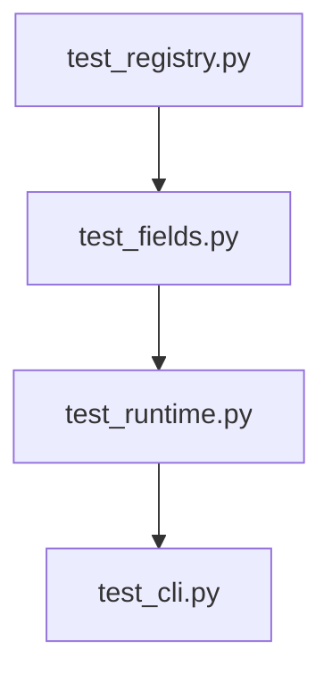
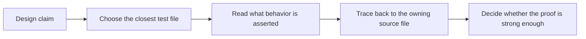

# Test Guide

<!-- page-maps:start -->
## Guide Maps

<!-- page-maps:end -->

Use this guide when you want the shortest path from a metaprogramming claim to the test
that actually proves it. The goal is not to admire coverage. The goal is to know what
kind of pressure each test file is meant to catch.

## Start by claim

| If the claim is about... | Start here | Escalate only if needed |
| --- | --- | --- |
| class-definition-time registration and manifest ownership | `tests/test_registry.py` | `tests/test_cli.py` |
| descriptor coercion, defaults, and per-instance storage | `tests/test_fields.py` | `tests/test_runtime.py` |
| runtime plugin creation and action history | `tests/test_runtime.py` | `tests/test_cli.py` |
| public command behavior and CLI promises | `tests/test_cli.py` | `make confirm` |
| saved review inventory stability | `tests/test_bundle_manifest.py` | `make verify-report` |

## Recommended reading order

1. `tests/test_registry.py`
2. `tests/test_fields.py`
3. `tests/test_runtime.py`
4. `tests/test_cli.py`
5. `tests/test_bundle_manifest.py`

That route keeps class-definition-time behavior first, descriptor rules second, runtime
invocation third, and public CLI proof last.

## What each file proves

| Test file | Main proof surface | First matching source files |
| --- | --- | --- |
| `test_registry.py` | deterministic registration, duplicate protection, and manifest shape rooted in class creation | `framework.py`, `plugins.py` |
| `test_fields.py` | descriptor validation, coercion, defaults, and per-instance storage behavior | `fields.py`, `plugins.py` |
| `test_runtime.py` | plugin creation, runtime invocation, action history, and manifest observation without execution | `framework.py`, `actions.py`, `plugins.py` |
| `test_cli.py` | public command behavior for manifest, invoke, and trace routes | `cli.py`, `framework.py` |
| `test_bundle_manifest.py` | stable saved-bundle inventory generation | `scripts/write_bundle_manifest.py` |

## Question to test map

| If the question is about... | Read this test file first | Then open |
| --- | --- | --- |
| registration order, duplicate protection, or manifest shape rooted in class creation | `tests/test_registry.py` | `framework.py` and `COMMAND_GUIDE.md` |
| field defaults, coercion, required values, or per-instance descriptor storage | `tests/test_fields.py` | `fields.py` and `DESIGN_BOUNDARIES.md` |
| action history, generated constructors, or one concrete plugin invocation path | `tests/test_runtime.py` | `actions.py`, `framework.py`, and `plugins.py` |
| CLI behavior for manifest, registry, invoke, or trace routes | `tests/test_cli.py` | `cli.py` and `COMMAND_GUIDE.md` |
| saved bundle inventory and artifact manifests | `tests/test_bundle_manifest.py` | `scripts/write_bundle_manifest.py` and `PROOF_GUIDE.md` |

## Failure-first reading order

1. Name the behavior that should fail first.
2. Open the matching test file from the table above.
3. Read the source file the failing test is meant to protect.
4. Expand into broader bundle or tour routes only when the test alone is not enough.

## Best proof questions

- Which test would fail first if registration started doing hidden work at import time?
- Which test would fail first if descriptor storage leaked between plugin instances?
- Which test would fail first if the action decorator stopped preserving visible behavior?
- Which test would fail first if the CLI became less observational and more magical?

## What this guide prevents

- using one passing CLI test as proof of the entire runtime
- reading only the concrete plugin tests and missing definition-time behavior
- treating metaclass behavior as untestable or too indirect to verify
- forgetting to update the right proof surface when a public command changes

## Good stopping point

Stop when you can name one test file that proves the claim in front of you and one
clear reason you would need a stronger route.
