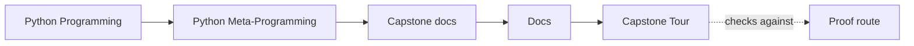
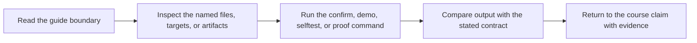

# Capstone Tour

<!-- page-maps:start -->
## Guide Maps

<!-- page-maps:end -->

Use this tour when you want a guided walk instead of jumping straight into the source.
Use `make tour` when you want this route captured as a saved bundle rather than only
reconstructed from one-off command output.

## Stop 1: `framework.py`

Read `PluginMeta`, then `PluginBase.manifest()`, then `build_manifest()`. This is the
best place to understand what happens at class-definition time and what stays visible
from the public surface.

Keep [DESIGN_BOUNDARIES.md](design-boundaries.md) nearby if the class-definition
timeline is still harder to hold than the file names.

## Stop 2: `fields.py`

Read `Field`, then one concrete specialization such as `StringField`. This is where the
course proves that attribute-level invariants can remain explicit.

## Stop 3: `actions.py`

Read `action()`. Focus on what the wrapper preserves and what extra runtime state it adds.

## Stop 4: `plugins.py`

Read `ConsoleNotifier`, `WebhookNotifier`, and `PagerNotifier`. These make the abstractions
concrete enough to review like ordinary production code.

Use [PACKAGE_GUIDE.md](package-guide.md) when the differences between the built-in
plugins are more useful than the shared framework machinery.

## Stop 5: tests

Read tests last, not first. The tests are strongest when you already know which claim
each source file is trying to own.

## Best command route

1. Run `make inspect` to inspect the public shape.
2. Run `make demo` to see one concrete action result.
3. Run `make trace` to see configuration and action history.
4. Run `make tour` to save that full route for review.
5. Run `make confirm` when you want the stronger executable proof.

Read [TEST_GUIDE.md](test-guide.md) when the trace output is the most important surface
for the question you are holding.

Read [PACKAGE_GUIDE.md](package-guide.md) when the tour gives enough overall shape but you
need a narrower source route for one specific question.
