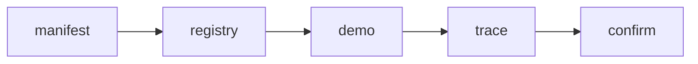
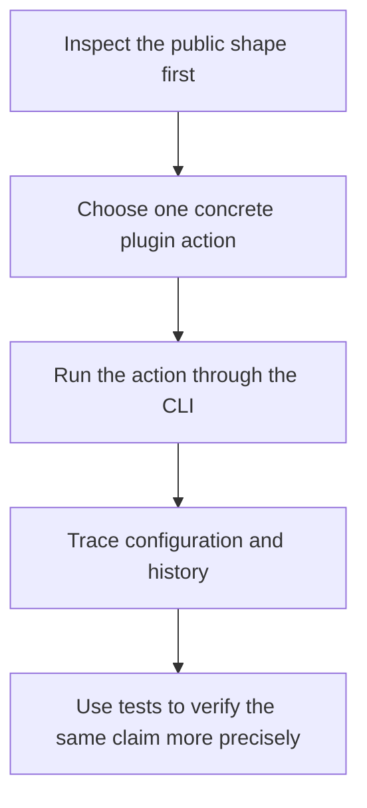

# Walkthrough Guide

<!-- page-maps:start -->
## Guide Maps

<!-- page-maps:end -->

Use this guide when you want the capstone as a human review route rather than as a pile
of advanced Python mechanisms. The goal is to see the runtime from the public surface
before you dive into metaclasses, descriptors, and wrappers.

## First pass versus deeper pass

- First pass: stop after `make trace` if the goal is to understand one honest public story from schema to invocation history.
- Deeper pass: add `make confirm` only when the question becomes executable confidence rather than guided explanation.

## Recommended walkthrough

1. Run `make manifest` to inspect the observable plugin schema.
2. Run `make registry` to confirm which concrete plugins are actually registered.
3. Run `make demo` to invoke one realistic delivery action.
4. Run `make trace` to inspect configuration, action history, and result together.
5. Run `make confirm` when you want the stronger executable proof behind the story.

## What the walkthrough should teach

- manifest inspection should stay observational and should not execute plugin actions
- registration should be visible as stable runtime data rather than hidden magic
- one CLI invocation should show how descriptors, decorators, and plugins meet at runtime
- trace output should make wrapper history visible instead of burying it in internals

## Best source files during the walkthrough

- `src/incident_plugins/cli.py`
- `src/incident_plugins/framework.py`
- `src/incident_plugins/actions.py`
- `src/incident_plugins/plugins.py`
- `tests/test_cli.py`

## What this guide prevents

- starting with the metaclass before you understand the public consequences
- treating manifest output as if it proved runtime invocation by itself
- skipping trace review and missing the recorded wrapper history
- reading the whole capstone without one explicit guided order

## Good stopping point

Stop when you can explain one plugin action from public manifest to trace output without
opening the entire source tree or defaulting to the full test route.

Read [EXTENSION_GUIDE.md](extension-guide.md) when the order is clear
but the right starting route for the current question is not.
