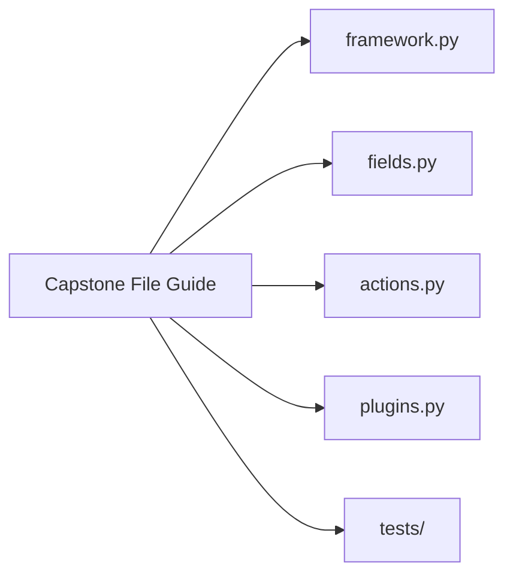

# Capstone File Guide

<!-- page-maps:start -->
## Page Maps



```mermaid
flowchart TD
  start["Need to inspect one behavior"] --> ask["What kind of behavior is it?"]
  ask --> attr["Attribute validation"] --> fields
  ask --> call["Callable wrapping"] --> actions
  ask --> classDef["Class creation or registry"] --> framework
  ask --> concrete["Real plugin examples"] --> plugins
  ask --> proof["Regression and failure cases"] --> tests
```
<!-- page-maps:end -->

This guide prevents one common learning failure: opening the capstone but not knowing
which file owns which responsibility.

## Source files

### `framework.py`

Owns the metaclass, generated constructor signature, registry, manifest export, and
runtime invocation entrypoints.

### `fields.py`

Owns descriptor-backed configuration semantics, coercion, and field manifest metadata.

### `actions.py`

Owns callable wrapping, signature preservation, and action history recording.

### `plugins.py`

Owns concrete delivery plugins that make the abstractions visible in realistic examples.

## Test files

### `test_fields.py`

Proves field validation, coercion, and per-instance behavior.

### `test_registry.py`

Proves constructor signature generation, deterministic registration, and action metadata preservation.

### `test_runtime.py`

Proves manifest export, runtime invocation, and action-history recording.

## Reading tip

When a mechanism feels too abstract, move from the owning source file to the matching
test file immediately. The course is strongest when implementation and proof stay adjacent.
