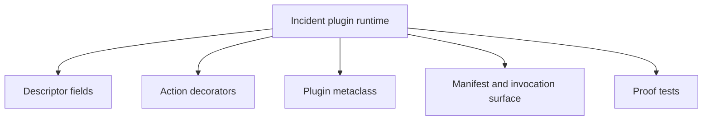
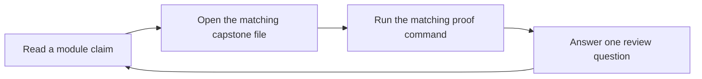

# Capstone Map

<!-- page-maps:start -->
## Page Maps

<!-- page-maps:end -->

This map keeps the course attached to one executable system. The capstone is a plugin
runtime for incident delivery adapters, and each major course mechanism has a clearly
named home inside it.

## Mechanism to file map

- introspection and manifest export: `capstone/src/incident_plugins/framework.py`
- action wrappers and signature preservation: `capstone/src/incident_plugins/actions.py`
- descriptor-backed field contracts: `capstone/src/incident_plugins/fields.py`
- concrete plugin classes and realistic behavior: `capstone/src/incident_plugins/plugins.py`
- proof and regression coverage: `capstone/tests/`

## Module to capstone route

- [Module 03](module-03.md): inspect signatures and docs from the manifest surface
- [Modules 04-05](module-04.md): compare raw action methods with wrapped action metadata
- [Modules 07-08](module-07.md): inspect descriptor declaration, storage, and validation flow
- [Module 09](module-09.md): inspect registration and class-definition-time invariants
- [Modules 10-11](module-10.md): inspect whether the public surface remains observable and governable

## Local review guides

- Use `capstone/PACKAGE_GUIDE.md` when you need a code-reading route.
- Use `capstone/TEST_GUIDE.md` when you need the shortest proof route.
- Use `capstone/WALKTHROUGH_GUIDE.md` when you need the public-surface narrative order.
- Use `capstone/TARGET_GUIDE.md` when you need the smallest honest command.
- Use `capstone/INSPECTION_GUIDE.md` and `capstone/EXTENSION_GUIDE.md` when the question is review depth or change placement.

## Practical reading order

1. Read `framework.py` for the metaclass and public manifest surface.
2. Read `fields.py` for attribute ownership.
3. Read `actions.py` for wrapper discipline.
4. Read `plugins.py` for concrete plugin behavior.
5. Read tests only after you know what each file claims to own.
