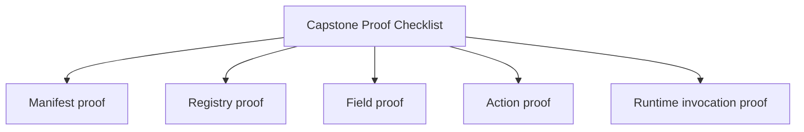
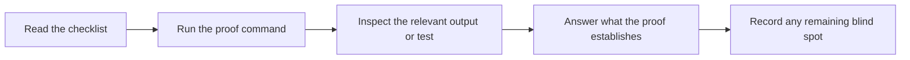

# Capstone Proof Checklist

<!-- page-maps:start -->
## Page Maps

<!-- page-maps:end -->

Use this checklist to confirm that the capstone proves what the course claims, rather
than only "having some tests."

## Proof targets

- The manifest exposes field and action metadata without executing plugin work.
- The generated constructor signature reflects declared fields accurately.
- Descriptor-backed fields validate and coerce configuration per instance.
- Action decorators preserve signature visibility and record invocation history.
- Plugin registration stays deterministic and rejects duplicates.

## Minimum proof route

1. Run `make PROGRAM=python-programming/python-meta-programming test`.
2. Read `capstone/tests/test_runtime.py`.
3. Read `capstone/tests/test_registry.py`.
4. Read `capstone/tests/test_fields.py`.
5. Read `capstone/tests/test_cli.py`.

## Stronger proof route

Also:

- run `make PROGRAM=python-programming/python-meta-programming inspect`
- run `make PROGRAM=python-programming/python-meta-programming capstone-verify-report`
- compare the saved bundle outputs with the underlying test expectations

## Questions to answer

- Which proof confirms definition-time work rather than runtime work?
- Which proof confirms preserved metadata rather than only produced output?
- Which saved bundle is strongest for a human review without rerunning commands?
- Which proof would fail first if the design became more magical?
