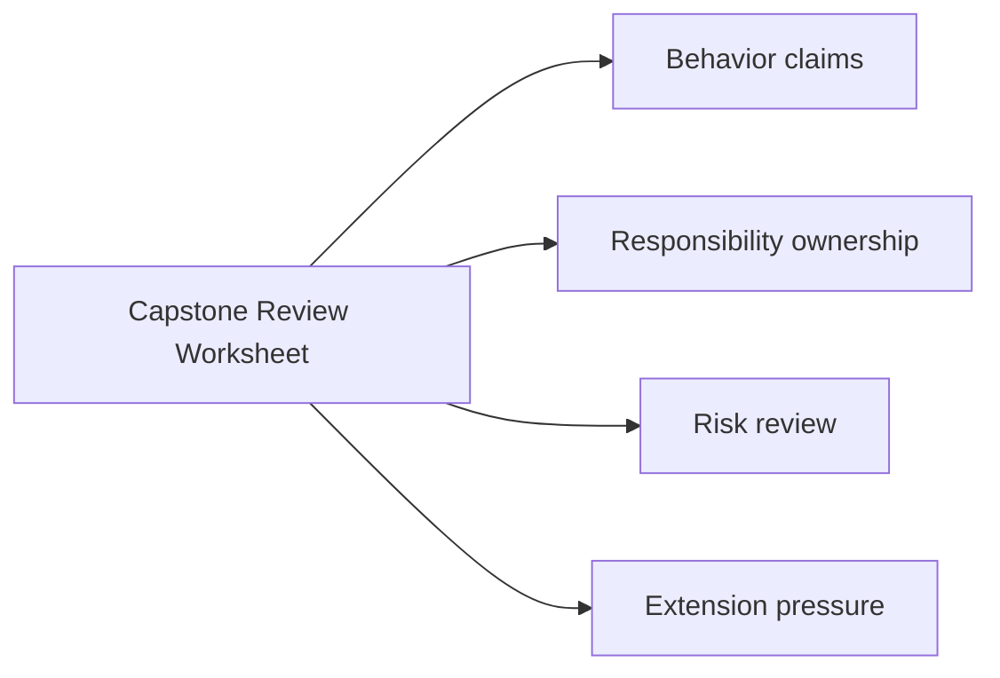
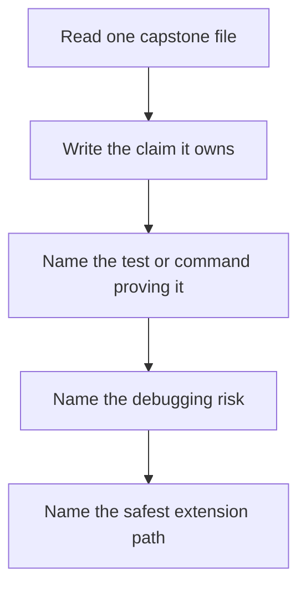

# Capstone Review Worksheet

<!-- page-maps:start -->
## Page Maps

<!-- page-maps:end -->

Use this worksheet while reviewing or extending the capstone.

## Behavior claims

- Which file owns class-definition-time behavior?
- Which file owns attribute validation?
- Which file owns runtime invocation and public manifest output?
- Which saved bundle would let another reviewer verify that claim later?

## Ownership questions

- Could any invariant move to a lower-power mechanism?
- Does any file own two responsibilities that should be separated?
- Which public names are stable enough to document as course-level entrypoints?

## Risk review

- Which design choice is hardest to debug if a test starts failing at import time?
- Where could hidden global state leak between tests or plugins?
- Which part would become unsafe first if someone tried to add dynamic execution?
- Which public command would start lying first if observability regressed?

## Extension prompts

- Add one new plugin without changing the metaclass.
- Add one new field type without changing concrete plugins.
- Add one new action-oriented proof without changing the registry contract.
- Decide which local guide would have to change after each extension.
