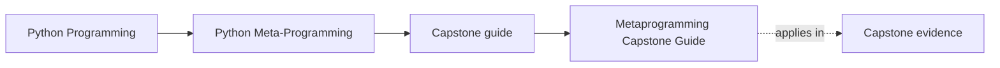

# Metaprogramming Capstone Guide


<!-- page-maps:start -->
## Page Maps




<!-- page-maps:end -->

The metaprogramming capstone is the course’s executable proof. It is where introspection,
decorators, descriptors, and metaclasses stop being isolated topics and start interacting
inside one runtime.

## What this capstone is proving

The capstone is a plugin runtime for incident-delivery adapters with:

- descriptor-backed configuration fields
- action decorators that preserve signatures and record calls
- a metaclass that gathers fields and registers plugins
- introspection-driven manifest export that does not execute plugin behavior

Its size is deliberate. The runtime is small enough to audit and large enough to force the mechanisms to coexist honestly.

## How to use it while reading

- After Module 04, inspect how action wrappers keep signatures and metadata visible.
- After Module 07, inspect how `Field` descriptors own validation and per-instance storage.
- After Module 09, inspect what `PluginMeta` enforces at class-definition time.
- After Module 10, inspect how manifest export keeps the runtime observable instead of magical.

## Best entrypoints

- Repository guide: [`capstone/README.md`](https://github.com/bijux/bijux-masterclass/blob/master/programs/python-programming/python-meta-programming/capstone/README.md)
- Runtime framework: [`capstone/src/incident_plugins/`](https://github.com/bijux/bijux-masterclass/tree/master/programs/python-programming/python-meta-programming/capstone/src/incident_plugins)
- Tests: [`capstone/tests/`](https://github.com/bijux/bijux-masterclass/tree/master/programs/python-programming/python-meta-programming/capstone/tests)

## Core commands

```bash
make PROGRAM=python-programming/python-meta-programming test
make -C capstone confirm
```

## What to inspect during review

- Which behavior happens at definition time and which happens at runtime?
- Which wrappers preserve identity and which could damage tooling visibility?
- Which invariants belong on fields, on classes, or in plain runtime code?
- Which parts of the runtime stay observable without executing plugin actions?
