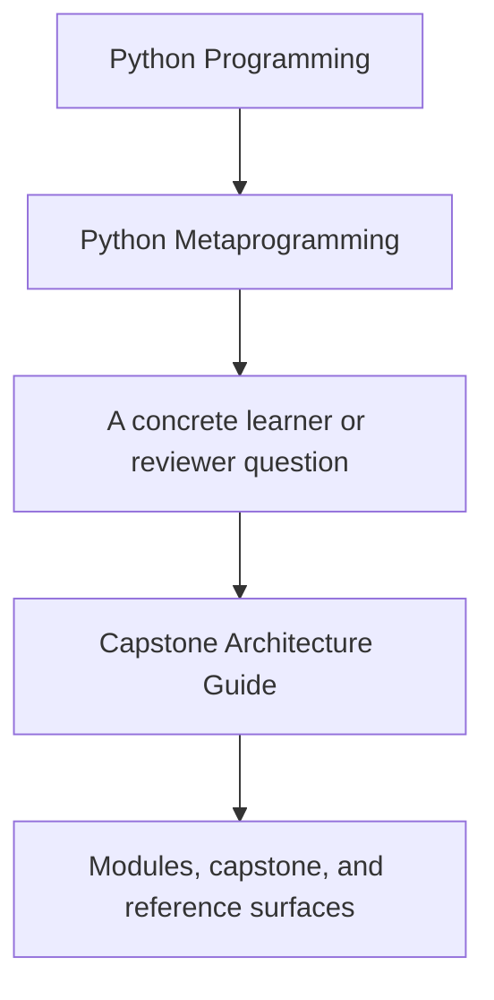
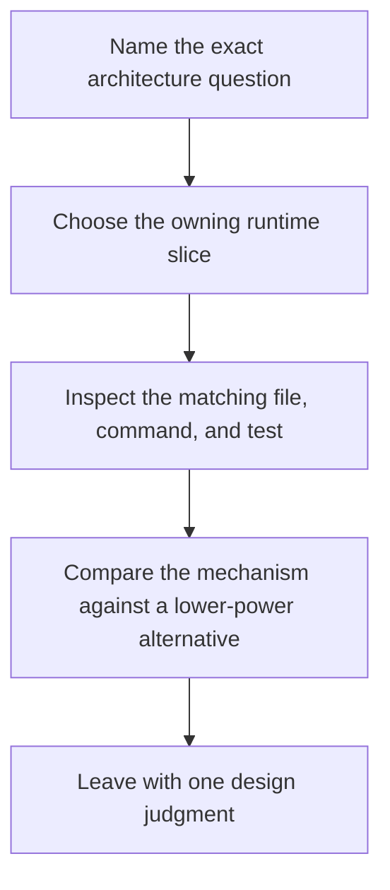

# Capstone Architecture Guide

<!-- page-maps:start -->
## Guide Fit

<!-- page-maps:end -->

Read the first diagram as a timing map: this guide is for a named architecture question,
not for wandering the whole course-book. Read the second diagram as the architecture loop:
choose the owning slice, inspect it, compare it against a lower-power alternative, then
leave with one design judgment.

Use this page when the capstone repository feels busy and you need the ownership model in
one place before reading more code.

## Start by architecture question

| If the architecture question is... | Start with | Then inspect |
| --- | --- | --- |
| what the public CLI can show without hidden work | public observation | `cli.py`, manifest helpers, and `make manifest` |
| where wrapper behavior should stop | callable transformation | `actions.py` and `make trace` |
| where validation really belongs | attribute contracts | `fields.py` and `test_fields.py` |
| what must happen before the class exists | class-creation rules | `framework.py` and `test_registry.py` |
| where realistic delivery behavior should stay concrete | concrete domain examples | `plugins.py`, `scenarios.py`, and `make plugin` |

## The capstone architecture in one sentence

The capstone is a small plugin runtime where introspection, wrappers, descriptors, and a
metaclass each own one narrow boundary and the CLI exposes those boundaries without hiding them.

## Main ownership slices

| Slice | Owner | What it owns | What it does not own |
| --- | --- | --- | --- |
| public observation | `src/incident_plugins/cli.py` and manifest helpers in `framework.py` | learner-facing inspection routes, manifest export, registry and signature reporting | business policy hidden behind private helper magic |
| callable transformation | `src/incident_plugins/actions.py` | action wrapping, signature preservation, and action-history recording | field validation, registry design, or class creation |
| attribute contracts | `src/incident_plugins/fields.py` | field metadata, coercion, validation, and per-instance storage behavior | action invocation semantics or plugin registration |
| class-creation rules | `src/incident_plugins/framework.py` | plugin registration, generated constructor signatures, and manifest assembly | application-specific delivery behavior |
| concrete domain examples | `src/incident_plugins/plugins.py` and `src/incident_plugins/scenarios.py` | realistic delivery plugins and demo scenarios that make the abstractions inspectable | framework ownership of every rule in the system |

## Why this architecture teaches well

- The wrapper logic is visible in one file instead of being spread across plugins.
- The field logic is visible in one file instead of being buried inside plugin constructors.
- The metaclass stays narrow enough that learners can compare it to class decorators and explicit registration.
- The CLI and saved bundles make the runtime observable before learners read internals.

## Architecture questions to ask while reading

- Which behavior belongs to attribute access instead of function wrapping?
- Which work must happen before the class exists?
- Which facts can the CLI expose without invoking business actions?
- Which part would become clearer if rewritten with a lower-power tool?

## Best reading order for the architecture

1. Read [Capstone Guide](index.md) to understand the public claim of the project.
2. Run or inspect `make manifest` and `make registry` to see the public runtime shape first.
3. Read `src/incident_plugins/framework.py` for the class-creation and manifest boundary.
4. Read `src/incident_plugins/fields.py` for attribute ownership.
5. Read `src/incident_plugins/actions.py` for wrapper ownership.
6. Read `src/incident_plugins/plugins.py` for concrete behavior only after the boundaries are clear.
7. Read the matching tests to confirm the architecture story.

## What not to do first

- Do not start in `plugins.py` when the ownership question is still abstract.
- Do not start in tests when the owning slice is not yet named.
- Do not compare higher-power mechanisms until the lower-power alternative is explicit.

## Best companion pages

- [Capstone Guide](index.md) for the capstone's role in the course
- [Capstone Map](capstone-map.md) for the module-to-repository route
- [Capstone File Guide](capstone-file-guide.md) for file ownership
- [Capstone Walkthrough](capstone-walkthrough.md) for a guided first reading pass
