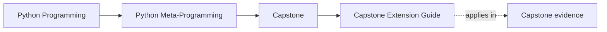

# Capstone Extension Guide

<!-- page-maps:start -->
## Page Maps

<!-- page-maps:end -->

Read the first diagram as a timing map: this guide is for a named pressure, not for wandering the whole course-book. Read the second diagram as the guide loop: arrive with a concrete question, use only the matching sections, then leave with one smaller and more honest next move.

This guide explains how to extend the capstone without making it pedagogically muddy.
The rule is to keep one extension attached to one clear ownership boundary.

## Start by extension type

| If you are adding... | Start with | Prove it with |
| --- | --- | --- |
| a new plugin | `plugins.py` | `make plugin`, `make trace`, and runtime tests |
| a new field type | `fields.py` | `make field` and field tests |
| a new action | one plugin method plus `@action` | `make action`, `make trace`, and runtime tests |

## Safe extension categories

### Add a new plugin

Edit `plugins.py`, add one concrete subclass, and prove that registration, manifest
export, and invocation all work without changing metaclass internals.

### Add a new field type

Edit `fields.py`, add a new descriptor specialization, and prove coercion and manifest
shape before using it in a plugin.

### Add a new action

Edit one plugin method, use `@action`, and prove the wrapper preserves signature and
history recording.

## Unsafe extension patterns

- adding metaclass behavior before trying a class decorator or plain function
- making manifest generation execute plugin methods
- hiding registry resets or test isolation inside unrelated helper code

## Review rule

Every extension should answer:

- why this layer owns the change
- why a lower-power layer was insufficient
- what new proof was added to keep the runtime observable
- which local capstone guide or review bundle changed as a result

## What not to do during an extension

- Do not widen the metaclass when a plugin, field, or action layer still owns the change.
- Do not skip the public route and jump straight to tests.
- Do not leave the local guides unchanged if the guided route has really changed.
