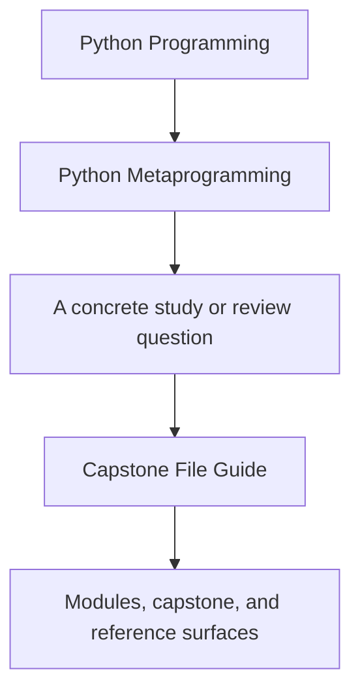
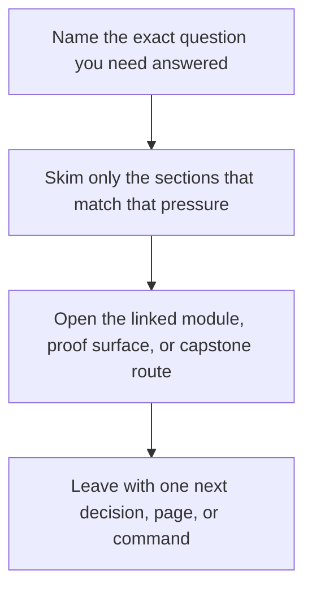

# Capstone File Guide

<!-- page-maps:start -->
## Guide Fit

<!-- page-maps:end -->

Read the first diagram as a timing map: this guide is for a named pressure, not for wandering the whole course-book. Read the second diagram as the guide loop: arrive with a concrete question, use only the matching sections, then leave with one smaller and more honest next move.

This guide prevents one common learning failure: opening the capstone but not knowing
which file owns which responsibility.

## Start by question

| If your question is... | Start with | Then read |
| --- | --- | --- |
| what exists before any instance is created | `framework.py` | `test_registry.py` |
| how one field validates and stores data | `fields.py` | `test_fields.py` |
| how one wrapped action preserves metadata | `actions.py` | `test_runtime.py` |
| how the abstractions look in a concrete plugin | `plugins.py` | `test_runtime.py` |

## Source files

### `framework.py`

Owns the metaclass, generated constructor signature, registry, manifest export, and
runtime invocation entrypoints.

### `fields.py`

Owns descriptor-backed configuration semantics, coercion, and field manifest metadata.

### `actions.py`

Owns callable wrapping, signature preservation, and action history recording.

### `plugins.py`

Owns concrete delivery plugins that make the abstractions visible in realistic examples.

## Test files

### `test_fields.py`

Proves field validation, coercion, and per-instance behavior.

### `test_registry.py`

Proves constructor signature generation, deterministic registration, and action metadata preservation.

### `test_runtime.py`

Proves manifest export, runtime invocation, and action-history recording.

## Reading tip

When a mechanism feels too abstract, move from the owning source file to the matching
test file immediately. The course is strongest when implementation and proof stay adjacent.

## What not to do first

- Do not start in `plugins.py` if the ownership model is still fuzzy.
- Do not start in tests if you cannot yet name the owning source file.
- Do not open every file in order when one question only needs one ownership route.

## Module-to-file route

- Modules 01-03: `framework.py`, `test_registry.py`, and `test_runtime.py`
- Modules 04-05: `actions.py` and `test_runtime.py`
- Modules 06-08: `fields.py` and `test_fields.py`
- Module 09: `framework.py` and `test_registry.py`
- Module 10 and mastery review: `README.md`, `PROOF_GUIDE.md`, and the saved bundles under `artifacts/`
