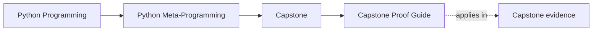
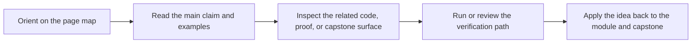

# Capstone Proof Guide

<!-- page-maps:start -->
## Page Maps

<!-- page-maps:end -->

Read the first diagram as a timing map: this guide is for a named pressure, not for wandering the whole course-book. Read the second diagram as the guide loop: arrive with a concrete question, use only the matching sections, then leave with one smaller and more honest next move.

Use this checklist to confirm that the capstone proves what the course claims, rather
than only "having some tests."

## Choose the proof pass you actually need

### Bounded review pass

Use this when you need one honest pass without reopening the whole runtime:

1. Read [Capstone Guide](index.md).
2. Run `make PROGRAM=python-programming/python-meta-programming capstone-tour`.
3. Read [Capstone Map](capstone-map.md).
4. Check one matching test file for the claim under review.

### Deeper executable pass

Use this when the review question is strong enough to justify the full saved proof route:

1. Run `make PROGRAM=python-programming/python-meta-programming test`.
2. Run `make PROGRAM=python-programming/python-meta-programming capstone-verify-report`.
3. Compare the saved outputs with the matching tests.

## Proof targets

- The manifest exposes field and action metadata without executing plugin work.
- The generated constructor signature reflects declared fields accurately.
- Descriptor-backed fields validate and coerce configuration per instance.
- Action decorators preserve signature visibility and record invocation history.
- Plugin registration stays deterministic and rejects duplicates.

## Minimum proof route

1. Run `make PROGRAM=python-programming/python-meta-programming test`.
2. Read `capstone/tests/test_runtime.py`.
3. Read `capstone/tests/test_registry.py`.
4. Read `capstone/tests/test_fields.py`.
5. Read `capstone/tests/test_cli.py`.

For a shorter module-aligned pass, use:

- Modules 01-03: read `manifest` output and `capstone/tests/test_runtime.py`.
- Modules 04-05: read `trace` output and `capstone/tests/test_runtime.py`.
- Modules 07-08: read `capstone/tests/test_fields.py`.
- Module 09: read `registry` output and `capstone/tests/test_registry.py`.
- Module 10: read `capstone/tests/test_cli.py` plus the saved verification bundle.

## Stronger proof route

Also:

- run `make PROGRAM=python-programming/python-meta-programming inspect`
- run `make PROGRAM=python-programming/python-meta-programming capstone-verify-report`
- compare the saved bundle outputs with the underlying test expectations

## Questions to answer

- Which proof confirms definition-time work rather than runtime work?
- Which proof confirms preserved metadata rather than only produced output?
- Which saved bundle is strongest for a human review without rerunning commands?
- Which proof would fail first if the design became more magical?

## Reviewer exit signal

You can stop the proof pass when you can say:

- which claim you checked
- which smallest route established it
- which stronger route you deliberately did not need yet

## Claim to evidence map

| Claim | Strongest proof surface |
| --- | --- |
| manifest export is observational, not operational | `inspect/manifest.json` plus `capstone/tests/test_cli.py` |
| wrappers preserve callable identity while adding behavior | `review/trace.json` plus `capstone/tests/test_runtime.py` |
| descriptor fields own validation and coercion per instance | `capstone/tests/test_fields.py` |
| registration happens at class-definition time and rejects duplicates | `inspect/registry.json` plus `capstone/tests/test_registry.py` |
| the public CLI remains a review surface instead of hidden runtime magic | `review/pytest.txt`, `review/manifest.json`, and `review/trace.json` |

## Module-stage checkpoints

- Modules 01-03: can you explain the manifest and generated constructor without executing a plugin action?
- Modules 04-05: can you show preserved action metadata from both tests and public output?
- Modules 06-08: can you point to one field invariant and the exact test proving per-instance behavior?
- Module 09: can you show where registration happens and how duplicate prevention is proven?
- Module 10 and mastery review: can you prove the public review commands are observational rather than operational?
