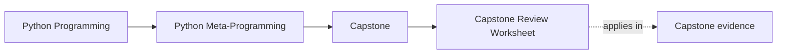
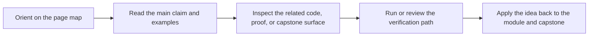

# Capstone Review Worksheet

<!-- page-maps:start -->
## Page Maps

<!-- page-maps:end -->

Read the first diagram as a timing map: this guide is for a named pressure, not for wandering the whole course-book. Read the second diagram as the guide loop: arrive with a concrete question, use only the matching sections, then leave with one smaller and more honest next move.

Use this worksheet while reviewing or extending the capstone.

## Bounded review pass

Use this worksheet in this order:

1. Name one claim under review.
2. Name one owning file.
3. Name one public command or saved bundle that exposes the claim.
4. Decide whether the result is keep, change, or reject.

## Behavior claims

- Which file owns class-definition-time behavior?
- Which file owns attribute validation?
- Which file owns runtime invocation and public manifest output?
- Which saved bundle would let another reviewer verify that claim later?

## Ownership questions

- Could any invariant move to a lower-power mechanism?
- Does any file own two responsibilities that should be separated?
- Which public names are stable enough to document as course-level entrypoints?

## Risk review

- Which design choice is hardest to debug if a test starts failing at import time?
- Where could hidden global state leak between tests or plugins?
- Which part would become unsafe first if someone tried to add dynamic execution?
- Which public command would start lying first if observability regressed?

## Extension prompts

- Add one new plugin without changing the metaclass.
- Add one new field type without changing concrete plugins.
- Add one new action-oriented proof without changing the registry contract.
- Decide which local guide would have to change after each extension.

## Module-stage prompts

- Modules 01-03: Which manifest or constructor fact would you inspect first, and why is it safe to inspect?
- Modules 04-05: Which wrapper behavior is visible in public output, and which part still requires reading tests?
- Modules 06-08: Which field rule belongs on attribute access rather than object construction?
- Module 09: Which invariant truly belongs at class-definition time?
- Module 10 and mastery review: Which public command gives the clearest review evidence for this claim?

## Good stopping point

Stop the worksheet once you can record:

- one claim
- one owner
- one proof route
- one judgment
