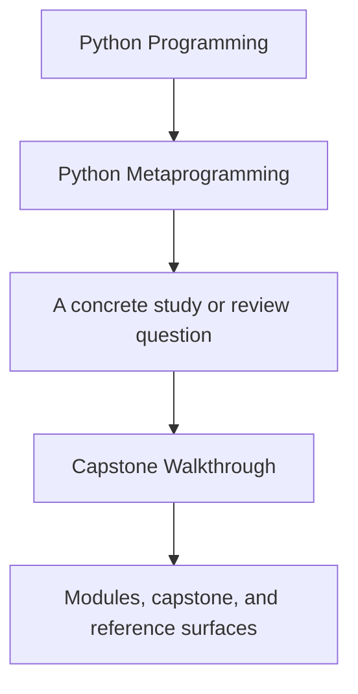
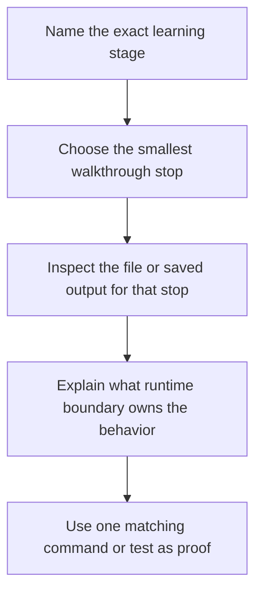

# Capstone Walkthrough

<!-- page-maps:start -->
## Guide Fit

<!-- page-maps:end -->

Read the first diagram as a timing map: this guide is for a named learning stage, not
for wandering the whole course-book. Read the second diagram as the walkthrough rhythm:
choose one stop, inspect the boundary, explain the owner, then prove it with one command
or test.

Use this page when you want the first honest tour through the capstone without turning it
into a file dump.

## First pass versus deeper pass

### First pass

Use stops 1 to 4 when the goal is to understand the runtime from the public surface.

### Deeper pass

Use stops 5 and 6 only after the earlier stops no longer settle the question.

## Walkthrough stop 1: Observe before execution

- Run `make manifest` or inspect the saved `manifest.json` from `make inspect`.
- Read `src/incident_plugins/cli.py` and the manifest helpers in `src/incident_plugins/framework.py`.
- Ask: which runtime facts can be exported without invoking plugin actions?
- Prove it with `make manifest`.

## Walkthrough stop 2: Find the registry boundary

- Run `make registry`.
- Read the registration code in `src/incident_plugins/framework.py`.
- Ask: what happens at class-definition time, and why is this deterministic in tests?
- Prove it with `tests/test_registry.py`.

## Walkthrough stop 3: Inspect one descriptor-backed field

- Run `make field`.
- Read `src/incident_plugins/fields.py`.
- Ask: where does per-instance field state actually live, and which invariant belongs to attribute access?
- Prove it with `tests/test_fields.py`.

## Walkthrough stop 4: Inspect one wrapper-backed action

- Run `make action` and then `make trace`.
- Read `src/incident_plugins/actions.py`.
- Ask: what did the wrapper add, and what original callable surface had to remain visible?
- Prove it with `tests/test_runtime.py`.

## Walkthrough stop 5: Inspect one concrete plugin

- Run `make plugin`.
- Read `src/incident_plugins/plugins.py`.
- Ask: which rules belong to the framework and which rules belong to the concrete adapter?
- Prove it by matching the plugin output to the field and action metadata already inspected.

## Walkthrough stop 6: Inspect the full guided route

- Run `make inspect` and `make PROGRAM=python-programming/python-meta-programming capstone-walkthrough`.
- Read the saved bundle under `artifacts/inspect/python-programming/python-meta-programming` and `artifacts/tour/python-programming/python-meta-programming`.
- Ask: does the public learning surface make the runtime easier to review than the raw source tree alone?
- Prove it by following `route.txt` and `focus-areas.txt`.

## Best walkthrough pairing by module

- Modules 01 to 03: stops 1 and 2
- Modules 04 to 05: stop 4
- Modules 06 to 08: stop 3
- Module 09: stop 2
- Module 10 and mastery review: stops 5 and 6

## When to stop and escalate

- Stop at the first walkthrough step that settles the current question.
- Escalate from one stop to the next only when the earlier output no longer proves enough.
- Move to [Capstone Architecture Guide](capstone-architecture-guide.md) when the question is about ownership rather than order.

## Good stopping point

Stop with this walkthrough once you can say:

- which public step settled the current question
- which owning file you would open next only if needed
- which later stop you deliberately did not need yet
