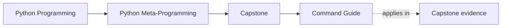
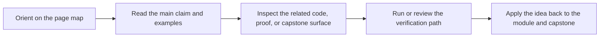

# Command Guide

<!-- page-maps:start -->
## Page Maps




<!-- page-maps:end -->

Read the first diagram as a timing map: this guide is for a named pressure, not for wandering the whole course-book. Read the second diagram as the guide loop: arrive with a concrete question, use only the matching sections, then leave with one smaller and more honest next move.

Use the smallest command that proves the specific claim you care about.

Keep [Proof Ladder](../guides/proof-ladder.md) open while reading this page if you are not yet sure
how much proof the current question actually needs.

## From the repository root

```bash
make PROGRAM=python-programming/python-meta-programming docs-serve
make PROGRAM=python-programming/python-meta-programming docs-build
make PROGRAM=python-programming/python-meta-programming test
make PROGRAM=python-programming/python-meta-programming demo
make PROGRAM=python-programming/python-meta-programming inspect
make PROGRAM=python-programming/python-meta-programming capstone-walkthrough
make PROGRAM=python-programming/python-meta-programming proof
make PROGRAM=python-programming/python-meta-programming capstone-tour
make PROGRAM=python-programming/python-meta-programming capstone-verify-report
make PROGRAM=python-programming/python-meta-programming capstone-confirm
make PROGRAM=python-programming/python-meta-programming capstone-manifest
make PROGRAM=python-programming/python-meta-programming capstone-plugin
make PROGRAM=python-programming/python-meta-programming capstone-field
make PROGRAM=python-programming/python-meta-programming capstone-action
make PROGRAM=python-programming/python-meta-programming capstone-registry
make PROGRAM=python-programming/python-meta-programming capstone-signatures
make PROGRAM=python-programming/python-meta-programming capstone-trace
```

## From `capstone/`

```bash
make demo
make inspect
make confirm
make proof
make manifest
make plugin
make field
make action
make registry
make signatures
make trace
make tour
make verify-report
```

## When to use which command

- `manifest`: inspect group-level schema and action metadata without execution
- `plugin`: inspect one concrete plugin contract from the public CLI
- `field`: inspect one concrete field contract and its exported schema
- `action`: inspect one concrete action contract and its generated signature
- `registry`: inspect registration determinism from the public surface
- `signatures`: inspect constructor and action signatures together
- `demo`: invoke one realistic plugin action directly in the terminal
- `trace`: inspect result, configuration, and action history together
- `inspect`: build the saved guided inspection bundle
- `capstone-walkthrough` from the repository root, or `tour` inside `capstone/`, writes the guided walkthrough bundle into `artifacts/`
- `capstone-tour`: use the same saved walkthrough bundle when you are moving through the proof ladder rather than the first-pass reading route
- `verify-report`: write the executable verification report bundle into `artifacts/`
- `confirm`: strongest local executable proof through pytest
- `proof`: full published review route with saved bundles

## A small proof-first route

1. Start with `manifest`, `registry`, `plugin`, `field`, `action`, or `signatures` when the question is about public shape.
2. Move to `demo` or `trace` when the question is about one concrete runtime behavior.
3. Move to `inspect` or `capstone-walkthrough` when the question is about guided study or source ownership.
4. Move to `verify-report`, `proof`, or `confirm` when the question is about executable confidence.
