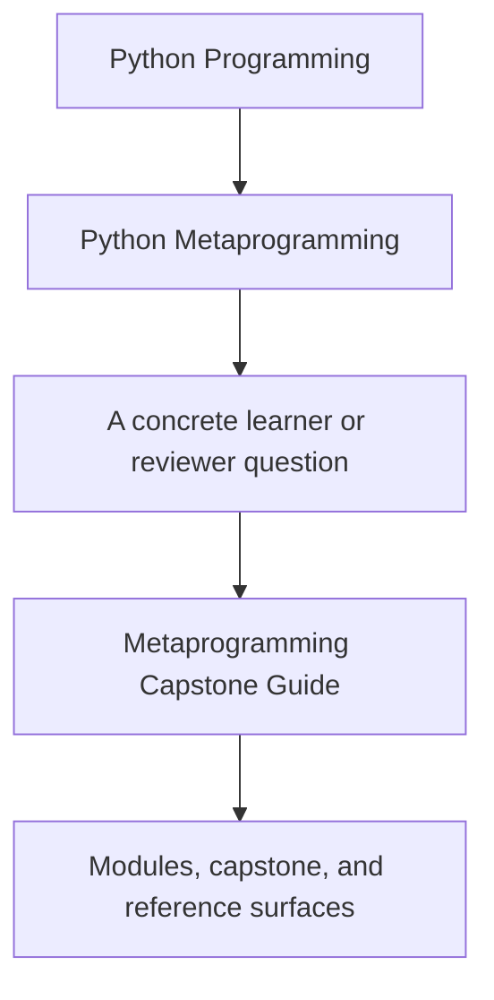
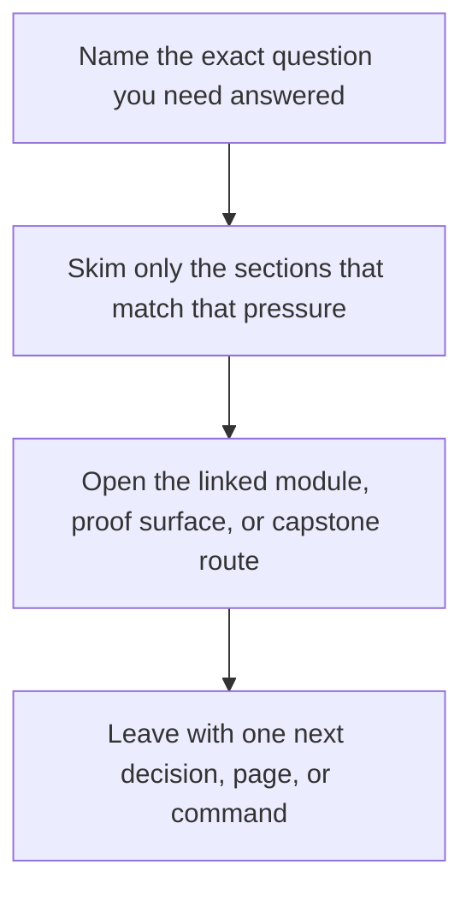

# Metaprogramming Capstone Guide

<!-- page-maps:start -->
## Guide Fit

<!-- page-maps:end -->

Read the first diagram as a timing map: this guide is for a named pressure, not for wandering the whole course-book. Read the second diagram as the guide loop: arrive with a concrete question, use only the matching sections, then leave with one smaller and more honest next move.

The metaprogramming capstone is the executable proof for the course. It is a compact
incident-plugin runtime where decorators, descriptors, metaclasses, and introspection
must coexist without hiding responsibility.

## What the capstone proves

- configuration invariants can live on descriptor-backed fields
- wrappers can preserve callable metadata while still recording action history
- class-definition-time registration can stay deterministic and testable
- manifest export can expose the runtime shape without executing plugin behavior

## Best route by module stage

- Modules 01-03: start with manifest export and constructor signatures.
- Modules 04-06: inspect `actions.py` and decorator-driven behavior before touching descriptors.
- Modules 07-08: inspect `fields.py` and the field-focused tests.
- Module 09: inspect registration and generated constructor behavior in `framework.py`.
- Module 10 and mastery review: use the public commands and saved bundles as the final review surface.

## Inspect, explain, prove

Use the capstone with one repeated rhythm:

1. Inspect one public output or one source file.
2. Explain which runtime boundary owns the behavior.
3. Prove the claim with one named test or saved bundle artifact.

This keeps the capstone from becoming a repository tour without a learning contract.

## Read these guides together

- [Capstone Map](capstone-map.md)
- [Capstone Architecture Guide](capstone-architecture-guide.md)
- [Capstone File Guide](capstone-file-guide.md)
- [Capstone Walkthrough](capstone-walkthrough.md)
- [Capstone Proof Checklist](capstone-proof-checklist.md)
- [Capstone Extension Guide](capstone-extension-guide.md)

## Best entrypoints

- repository guide: `capstone/README.md`
- runtime architecture: `capstone/ARCHITECTURE.md`
- proof route: `capstone/PROOF_GUIDE.md`
- source: `capstone/src/incident_plugins/`
- tests: `capstone/tests/`

## Review questions

- Which work happens before an instance exists?
- Which runtime facts are inspectable from the public surface?
- Which mechanism would you replace first if you had to simplify the design?

## Directory glossary

Use [Glossary](glossary.md) when you want the recurring language in this shelf kept stable while you move between repository routes, review surfaces, and proof commands.
