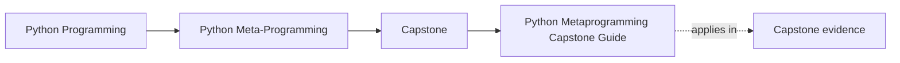
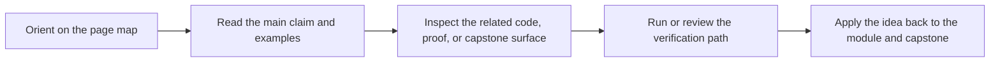

# Python Metaprogramming Capstone Guide

<!-- page-maps:start -->
## Page Maps

<!-- page-maps:end -->

The metaprogramming capstone is the executable proof for the course. It is a compact
incident-plugin runtime where decorators, descriptors, metaclasses, and introspection
must coexist without hiding responsibility.

Use this guide to enter the shelf question-first. The goal is not to browse the whole
runtime. The goal is to pick one mechanism, one owning boundary, and one proof surface.

## What this capstone proves

- descriptor-backed fields can hold configuration invariants without turning state opaque
- wrappers can preserve metadata while still recording runtime behavior
- class-definition-time registration can remain deterministic and inspectable
- manifest export can show the runtime shape without executing plugin side effects

## Choose the right capstone route

| If your question is... | Best page |
| --- | --- |
| Which capstone surface matches the current module? | [Capstone Map](capstone-map.md) |
| Which files should I read first? | [Capstone File Guide](capstone-file-guide.md) |
| Where do runtime boundaries and ownership live? | [Capstone Architecture Guide](capstone-architecture-guide.md) |
| Which proof route is honest for this claim? | [Capstone Proof Guide](capstone-proof-guide.md) |
| How should I review the runtime as a steward? | [Capstone Review Worksheet](capstone-review-worksheet.md) |
| Where should a new change land? | [Capstone Extension Guide](capstone-extension-guide.md) |

## Start by module range

| Module range | Best capstone focus |
| --- | --- |
| Modules 01-03 | manifest export, constructor signatures, and inspectable runtime shape |
| Modules 04-06 | decorators, wrappers, and action-history behavior |
| Modules 07-08 | descriptors, field validation, and focused field tests |
| Modules 09-10 | registration, generated constructors, public commands, and saved bundles |

## Core commands

| If you need... | From the repository root | From the capstone directory |
| --- | --- | --- |
| runtime shape without execution | `make PROGRAM=python-programming/python-meta-programming manifest` | `make manifest` |
| registry review | `make PROGRAM=python-programming/python-meta-programming registry` | `make registry` |
| walkthrough and saved proof | `make PROGRAM=python-programming/python-meta-programming capstone-walkthrough` | `make walkthrough` |

## Guide set

- [Capstone Map](capstone-map.md)
- [Capstone Walkthrough](capstone-walkthrough.md)
- [Command Guide](command-guide.md)
- [Capstone File Guide](capstone-file-guide.md)
- [Capstone Architecture Guide](capstone-architecture-guide.md)
- [Capstone Proof Guide](capstone-proof-guide.md)
- [Capstone Review Worksheet](capstone-review-worksheet.md)
- [Capstone Extension Guide](capstone-extension-guide.md)
- [Glossary](glossary.md)

## Review questions

- Which work happens before an instance exists?
- Which runtime facts stay inspectable from the public surface?
- Which mechanism would you simplify first if the design felt too magical?

## Stop here when

- you know which mechanism the current module is making visible
- you know which file or public output owns that mechanism
- you know the smallest command or bundle that proves it
