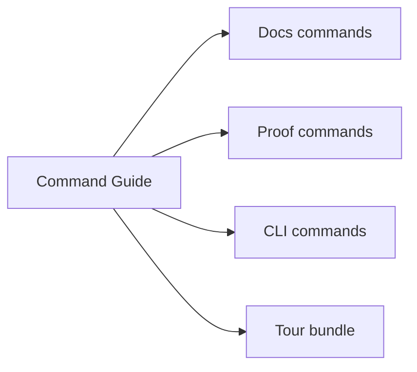
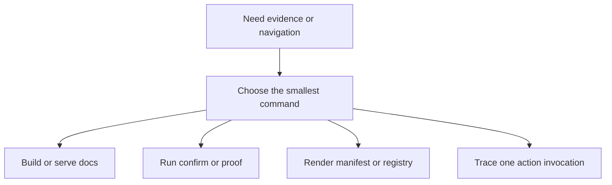

# Command Guide

<!-- page-maps:start -->
## Page Maps




<!-- page-maps:end -->

Use the smallest command that proves the specific claim you care about.

## From the repository root

```bash
make PROGRAM=python-programming/python-meta-programming docs-serve
make PROGRAM=python-programming/python-meta-programming docs-build
make PROGRAM=python-programming/python-meta-programming test
make PROGRAM=python-programming/python-meta-programming capstone-proof
make PROGRAM=python-programming/python-meta-programming capstone-manifest
make PROGRAM=python-programming/python-meta-programming capstone-trace
```

## From `capstone/`

```bash
make confirm
make proof
make manifest
make registry
make demo
make trace
make tour
```

## When to use which command

- `confirm`: regression proof through pytest
- `proof`: full public-surface proof route
- `manifest`: inspect schema and action metadata without execution
- `registry`: inspect registration determinism from the public surface
- `demo`: invoke one plugin action with a realistic example
- `trace`: inspect result, configuration, and action history together
- `tour`: write a learner-facing proof bundle into `artifacts/`
