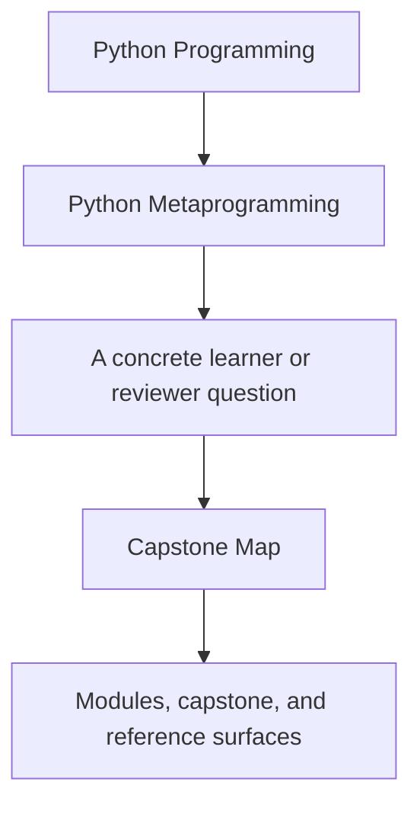
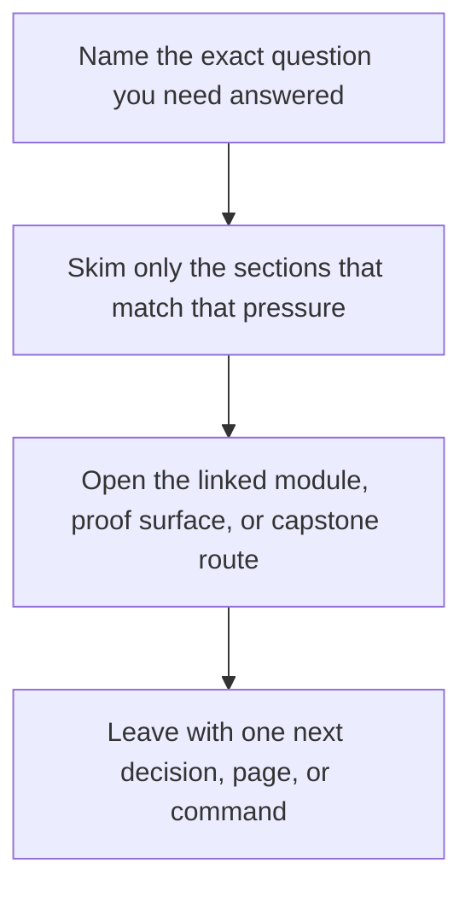

# Capstone Map

<!-- page-maps:start -->
## Guide Fit

<!-- page-maps:end -->

Read the first diagram as a timing map: this guide is for a named pressure, not for wandering the whole course-book. Read the second diagram as the guide loop: arrive with a concrete question, use only the matching sections, then leave with one smaller and more honest next move.

This map keeps the course attached to one executable system. The capstone is a plugin
runtime for incident delivery adapters, and each major course mechanism has a clearly
named home inside it.

## Mechanism to file map

- introspection and manifest export: `capstone/src/incident_plugins/framework.py`
- action wrappers and signature preservation: `capstone/src/incident_plugins/actions.py`
- descriptor-backed field contracts: `capstone/src/incident_plugins/fields.py`
- concrete plugin classes and realistic behavior: `capstone/src/incident_plugins/plugins.py`
- proof and regression coverage: `capstone/tests/`

## Module to capstone route

| Module stage | Inspect this file or surface | Why it matters | Prove it with |
| --- | --- | --- | --- |
| [Modules 01-03](../module-03-signatures-provenance-runtime-evidence/index.md) | `capstone/src/incident_plugins/framework.py` and `manifest` output | shows how fields and actions stay inspectable without executing plugin work | `make PROGRAM=python-programming/python-meta-programming inspect` then read `manifest.json` |
| [Modules 04-05](../module-04-function-wrappers-transparent-decorators/index.md) | `capstone/src/incident_plugins/actions.py` | shows wrapper policy, preserved metadata, and recorded action history | `make PROGRAM=python-programming/python-meta-programming proof` then inspect `trace.json` and `capstone/tests/test_runtime.py` |
| [Module 06](../module-06-class-customization-pre-metaclasses/index.md) | generated constructor behavior in `capstone/src/incident_plugins/framework.py` | shows what can stay honest after class creation before metaclasses become necessary | `make PROGRAM=python-programming/python-meta-programming test` then read `capstone/tests/test_runtime.py` |
| [Modules 07-08](../module-07-descriptors-lookup-attribute-control/index.md) | `capstone/src/incident_plugins/fields.py` | shows descriptor-backed validation, coercion, and per-instance storage ownership | `make PROGRAM=python-programming/python-meta-programming test` then read `capstone/tests/test_fields.py` |
| [Module 09](../module-09-metaclass-design-class-creation/index.md) | registration logic in `capstone/src/incident_plugins/framework.py` and `registry` output | shows definition-time registration and duplicate prevention | `make PROGRAM=python-programming/python-meta-programming inspect` then read `registry.json` and `capstone/tests/test_registry.py` |
| [Module 10](../module-10-runtime-governance-mastery-review/index.md) and [Mastery Review](../module-10-runtime-governance-mastery-review/mastery-review.md) | `capstone/src/incident_plugins/cli.py` plus saved proof bundles | shows that the public review surface stays observational and reviewable | `make PROGRAM=python-programming/python-meta-programming capstone-verify-report` then read `pytest.txt`, `manifest.json`, and `trace.json` |

## Local review guides

- Use `capstone/PACKAGE_GUIDE.md` when you need a code-reading route.
- Use `capstone/TEST_GUIDE.md` when you need the shortest proof route.
- Use `capstone/WALKTHROUGH_GUIDE.md` when you need the public-surface narrative order.
- Use `capstone/TARGET_GUIDE.md` when you need the smallest honest command.
- Use `capstone/INSPECTION_GUIDE.md` and `capstone/EXTENSION_GUIDE.md` when the question is review depth or change placement.

## Practical reading order

1. Read `framework.py` for the metaclass and public manifest surface.
2. Read `fields.py` for attribute ownership.
3. Read `actions.py` for wrapper discipline.
4. Read `plugins.py` for concrete plugin behavior.
5. Read tests only after you know what each file claims to own.

## Inspect, explain, prove

For each module-stage claim, use the same loop:

1. Inspect one source file or saved public output.
2. Explain which runtime boundary owns the behavior.
3. Prove the claim with one named test or one saved bundle file.
