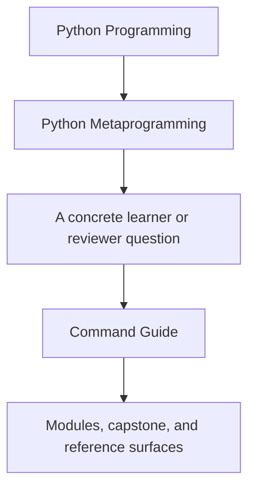
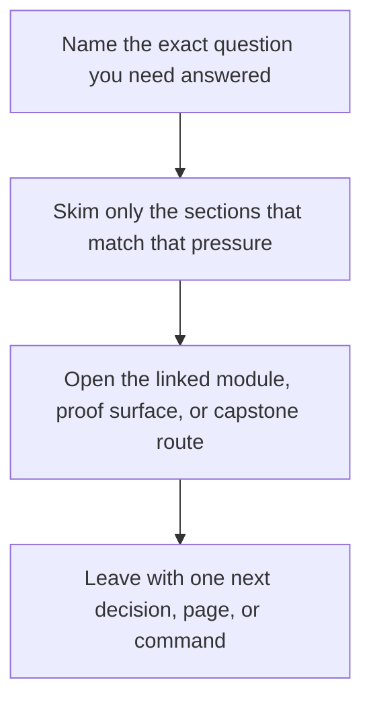

# Command Guide

<!-- page-maps:start -->
## Guide Fit




<!-- page-maps:end -->

Read the first diagram as a timing map: this guide is for a named pressure, not for wandering the whole course-book. Read the second diagram as the guide loop: arrive with a concrete question, use only the matching sections, then leave with one smaller and more honest next move.

Use the smallest command that proves the specific claim you care about.

## From the repository root

```bash
make PROGRAM=python-programming/python-meta-programming docs-serve
make PROGRAM=python-programming/python-meta-programming docs-build
make PROGRAM=python-programming/python-meta-programming test
make PROGRAM=python-programming/python-meta-programming demo
make PROGRAM=python-programming/python-meta-programming inspect
make PROGRAM=python-programming/python-meta-programming proof
make PROGRAM=python-programming/python-meta-programming capstone-tour
make PROGRAM=python-programming/python-meta-programming capstone-verify-report
make PROGRAM=python-programming/python-meta-programming capstone-confirm
make PROGRAM=python-programming/python-meta-programming capstone-manifest
make PROGRAM=python-programming/python-meta-programming capstone-trace
```

## From `capstone/`

```bash
make demo
make inspect
make confirm
make proof
make manifest
make registry
make trace
make tour
make verify-report
```

## When to use which command

- `demo`: invoke one realistic plugin action directly in the terminal
- `inspect`: build the saved learner-facing inspection bundle
- `confirm`: strongest local executable proof through pytest
- `proof`: full published review route with saved bundles
- `manifest`: inspect schema and action metadata without execution
- `registry`: inspect registration determinism from the public surface
- `trace`: inspect result, configuration, and action history together
- `tour`: write the learner-facing walkthrough bundle into `artifacts/`
- `verify-report`: write the executable verification report bundle into `artifacts/`
