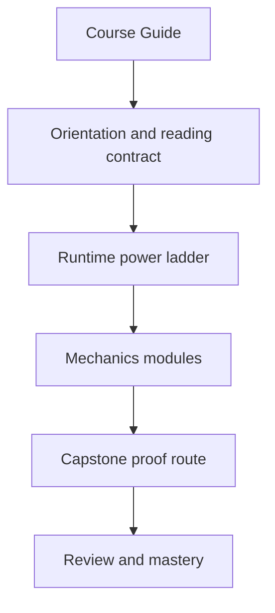
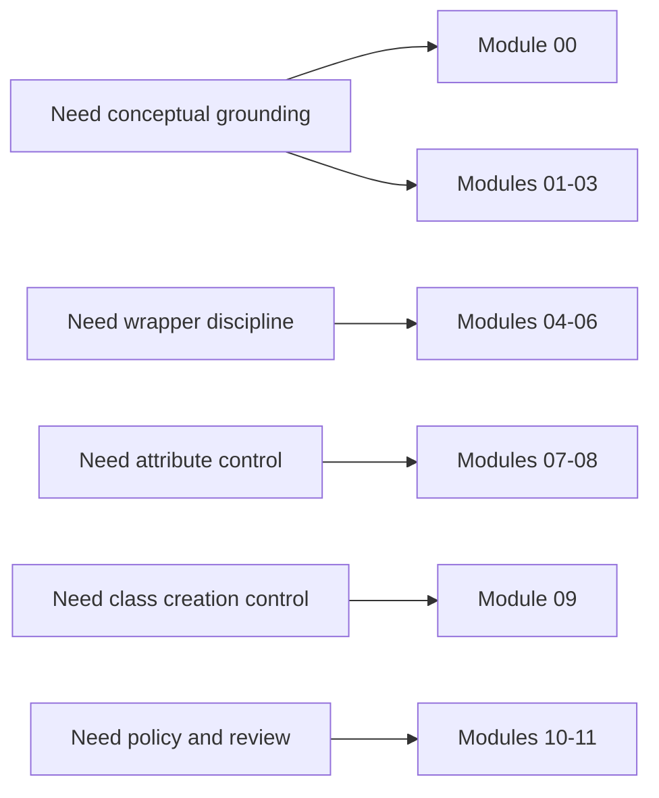

# Course Guide

<!-- page-maps:start -->
## Page Maps

<!-- page-maps:end -->

This guide explains how the course is organized and what each part is trying to teach.
The learner goal is not "know more hooks." The learner goal is "choose the lowest-power
hook that solves the problem without damaging debuggability."

## Course spine

The course has four linked layers:

1. entry pages and orientation
2. module work from introspection to governance
3. capstone proof in a single plugin runtime
4. review surfaces for judgment, debugging, and extension decisions

## The Four Arcs

### Runtime observation

Modules 01 to 03 build the observation floor:

- what Python objects are at runtime
- how to inspect without accidental execution
- how `inspect` turns runtime mechanics into evidence

### Wrapper discipline

Modules 04 to 06 move from observation to controlled transformation:

- wrappers preserve provenance instead of hiding it
- decorators become explicit policy rather than ornament
- class-level customization stops before metaclasses unless lower-power tools fail honestly

### Attribute and class control

Modules 07 to 09 explain the higher-power runtime hooks:

- descriptors make attribute lookup mechanical instead of mystical
- validation and framework-shaped attribute systems gain explicit ownership
- metaclasses stay narrow, justified, and reviewable

### Governance and mastery

Module 10 and [Mastery Review](../module-10-runtime-governance-and-mastery/mastery-review.md) convert mechanism knowledge into review policy:

- dynamic power gets red lines
- debugging cost becomes part of the design argument
- exit criteria replace sequel marketing

## How The Capstone Fits

- Modules 01 to 03 explain the capstone's runtime model, safe inspection surfaces, and provenance handling.
- Modules 04 to 06 explain its wrappers, decorators, and low-power class customization decisions.
- Modules 07 to 09 explain its descriptors, validation surfaces, and class-creation choices.
- Module 10 explains its governance rules and why stronger hooks remain narrow.

## Support Pages To Keep Open

- [Reading Routes](reading-routes.md) when you need a lower-density or pressure-shaped sequence
- [Runtime Power Ladder](../reference/runtime-power-ladder.md) when you need the governing review model
- [Module Dependency Map](module-dependency-map.md) when you need the sequence justified
- [Practice Map](practice-map.md) when you want the module-to-proof loop in one place
- [Command Guide](command-guide.md) when you need the executable route
- [Capstone Map](capstone-map.md) and [Capstone File Guide](capstone-file-guide.md) when you want the repository route kept explicit

## Honest Expectation

If you rush, the course will feel like a pile of hooks. If you read it in order and keep
the power ladder in view, the later modules should feel like consequences of earlier
runtime mechanics rather than cleverness contests.
