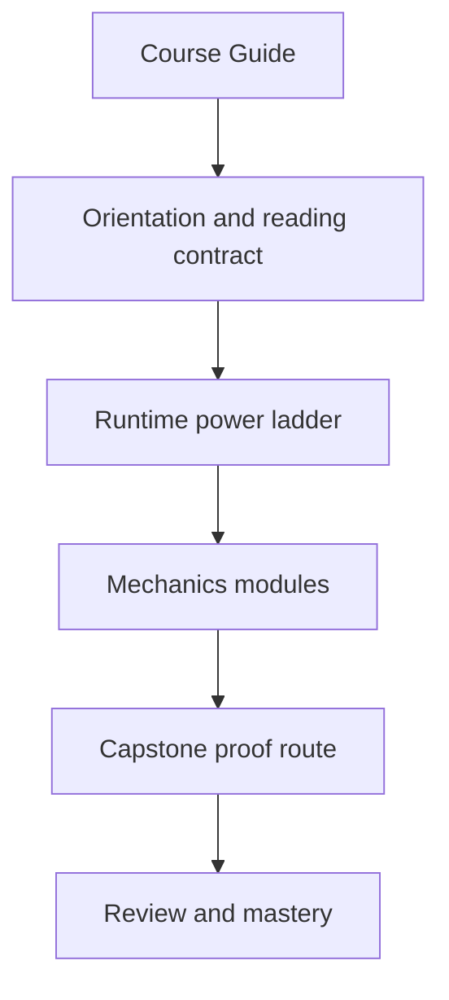
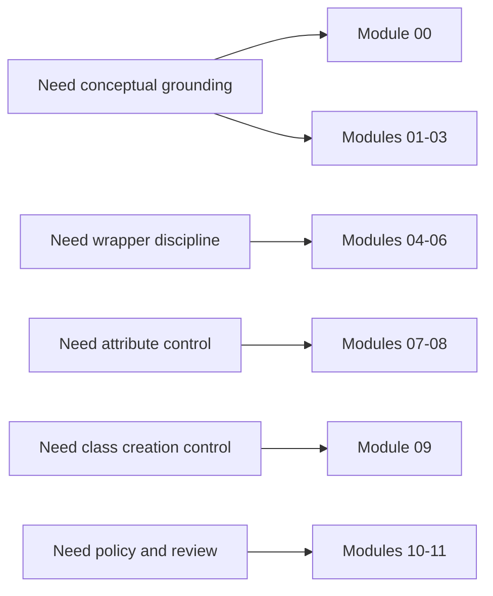

# Course Guide

<!-- page-maps:start -->
## Page Maps

<!-- page-maps:end -->

This guide explains how the course is organized and what each part is trying to teach.
The learner goal is not "know more hooks." The learner goal is "choose the lowest-power
hook that solves the problem without damaging debuggability."

## Course spine

The course has four linked layers:

1. orientation and reading discipline
2. runtime mechanics from introspection through metaclasses
3. capstone proof in a single plugin runtime
4. review surfaces for judgment, debugging, and extension decisions

## What each stage owns

### Orientation

- [Start Here](start-here.md) decides whether the course matches your current problem.
- [Module 00](../module-00.md) defines the power ladder and the rules for reading the course.

### Runtime mechanics

- [Modules 01-03](../module-01.md) through [module-03.md](../module-03.md) explain objects, introspection, and `inspect`.
- [Modules 04-06](../module-04.md) through [module-06.md](../module-06.md) explain decorators, typing discipline, and the bridge to attribute control.
- [Modules 07-09](../module-07.md) through [module-09.md](../module-09.md) explain descriptors, framework-grade patterns, and metaclasses.

### Governance

- [Module 10](../module-10.md) defines red lines for dynamic execution and high-power runtime hooks.
- [Module 11](../module-11.md) closes the course with mastery questions instead of sequel marketing.

### Capstone proof

- [Capstone Guide](capstone.md) explains the executable proof route.
- [Capstone Map](capstone-map.md) and [Capstone File Guide](capstone-file-guide.md) keep the mechanism-to-file mapping explicit.

## Recommended reading pattern

- Read one module.
- Inspect the named capstone file immediately.
- Run the smallest proof command that confirms the claim.
- Write down where the mechanism would become dishonest in real code.

## What to avoid while studying

- skipping straight to metaclasses before you can explain descriptors cleanly
- treating `inspect` output as harmless when it can trigger assumptions about runtime identity
- copying patterns into production code before you can say what they cost to debug
