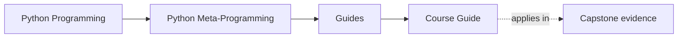
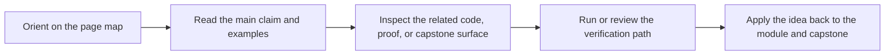

# Course Guide

<!-- page-maps:start -->
## Page Maps

<!-- page-maps:end -->

Read the first diagram as a timing map: this guide is for a named pressure, not for wandering the whole course-book. Read the second diagram as the guide loop: arrive with a concrete question, use only the matching sections, then leave with one smaller and more honest next move.

This guide explains how the course is organized and what each part is trying to teach.
The goal is not "know more hooks." The goal is to choose the lowest-power hook that
solves the problem without damaging debuggability.

## Course spine

The course has four linked layers:

1. entry pages and orientation
2. module work from introspection to governance
3. capstone proof in a single plugin runtime
4. review surfaces for judgment, debugging, and extension decisions

## The Four Arcs

### Runtime observation

Modules 01 to 03 build the observation floor:

- what Python objects are at runtime
- how to inspect without accidental execution
- how `inspect` turns runtime mechanics into evidence

### Wrapper discipline

Modules 04 to 06 move from observation to controlled transformation:

- wrappers preserve provenance instead of hiding it
- decorators become explicit policy rather than ornament
- class-level customization stops before metaclasses unless lower-power tools fail honestly

### Attribute and class control

Modules 07 to 09 explain the higher-power runtime hooks:

- descriptors make attribute lookup mechanical instead of mystical
- validation and framework-shaped attribute systems gain explicit ownership
- metaclasses stay narrow, justified, and reviewable

### Governance and mastery

Module 10 converts mechanism knowledge into review policy:

- dynamic power gets red lines
- debugging cost becomes part of the design argument
- exit criteria replace sequel marketing

## How The Capstone Fits

- Modules 01 to 03 explain the capstone's runtime model, safe inspection surfaces, and provenance handling.
- Modules 04 to 06 explain its wrappers, decorators, and low-power class customization decisions.
- Modules 07 to 09 explain its descriptors, validation surfaces, and class-creation choices.
- Module 10 explains its governance rules and why stronger hooks remain narrow.

## Support pages by moment

### When you are choosing how to enter

- [Pressure Routes](pressure-routes.md) when you are entering from a concrete engineering pressure
- [Start Here](start-here.md) when you need a lower-density or pressure-shaped sequence
- [Pressure Routes](pressure-routes.md) when you can name the engineering question faster than the module
- [Module Dependency Map](../reference/module-dependency-map.md) when you need the sequence justified

### When you are checking whether a module actually landed

- [Module Promise Map](module-promise-map.md) when you want the exact contract of each module stated plainly
- [Module Checkpoints](module-checkpoints.md) when you need a concrete exit bar before moving on
- [Proof Matrix](proof-matrix.md) when you want course-level promises tied to proof surfaces
- [Practice Map](../reference/practice-map.md) when you want the module-to-proof loop in one place

### When you are deciding whether a dynamic mechanism is justified

- [Proof Ladder](proof-ladder.md) when you need the smallest honest command for the current claim
- [Review Checklist](../reference/review-checklist.md) when you need the governing review bar
- [Pressure Routes](pressure-routes.md) when you need a problem-to-tool comparison with the lowest-power alternative kept visible
- [Topic Boundaries](../reference/topic-boundaries.md) when you need to decide what belongs inside the course center
- [Anti-Pattern Atlas](../reference/anti-pattern-atlas.md) when you are recognizing a smell before you can name the mechanism

### When you need the executable surface

- [Command Guide](../capstone/command-guide.md) when you need the executable route
- [Capstone Map](../capstone/capstone-map.md) when you need the module-to-repository route
- [Capstone File Guide](../capstone/capstone-file-guide.md) when you need the owning files kept explicit

## Honest Expectation

If you rush, the course will feel like a pile of hooks. If you read it in order and keep
the power ladder in view, the later modules should feel like consequences of earlier
runtime mechanics rather than cleverness contests.
