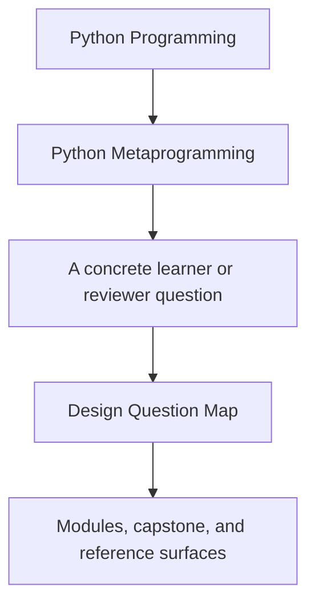
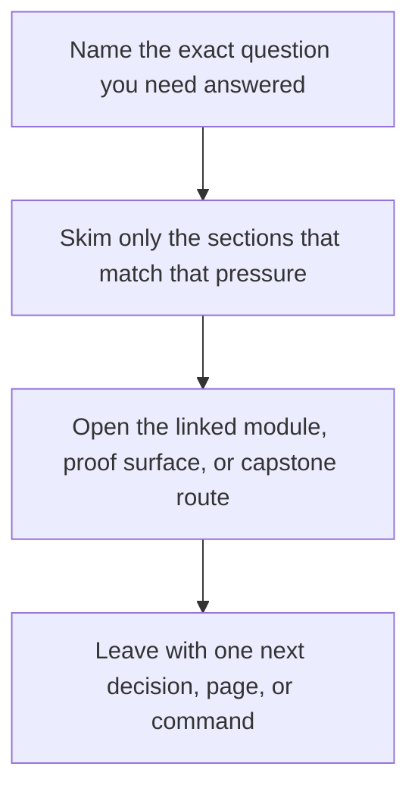

# Design Question Map

<!-- page-maps:start -->
## Guide Fit

<!-- page-maps:end -->

Read the first diagram as a timing map: this guide is for a named pressure, not for
wandering the whole course-book. Read the second diagram as the guide loop: arrive with
a concrete question, use only the matching sections, then leave with one smaller and
more honest next move.

Use this page when the learner problem is easier to name than the module or mechanism
that teaches it.

## Question to route table

| If the question is... | Start with | Keep this guide open | Capstone cross-check |
| --- | --- | --- | --- |
| What is Python actually doing at runtime here? | Modules 01 to 03 | [First-Contact Map](../module-00-orientation/first-contact-map.md) | manifest output and `framework.py` |
| How can I inspect this safely without accidentally running business logic? | Module 02 | [Proof Ladder](proof-ladder.md) | `make manifest`, `make registry`, and `cli.py` |
| Did this wrapper preserve the callable contract honestly? | Modules 03 to 05 | [Mechanism Selection](mechanism-selection.md) | `make action`, `make signatures`, and `actions.py` |
| Should this behavior live in a wrapper, a property, or a descriptor? | Modules 06 to 08 | [Mechanism Selection](mechanism-selection.md) | `fields.py`, `make field`, and field tests |
| Does this rule truly belong at class creation time? | Module 09 | [Mastery Map](../module-00-orientation/mastery-map.md) | `make registry`, `framework.py`, and registry tests |
| Is this metaclass doing real work or just hiding a lower-power option? | Module 09 | [Anti-Pattern Atlas](../reference/anti-pattern-atlas.md) | registry output and constructor signatures |
| Which runtime hooks are too dangerous to approve casually? | Module 10 | [Review Checklist](../reference/review-checklist.md) | `make verify-report` and the saved public evidence |
| What would I reject as making the system more magical than necessary? | Module 10 | [Topic Boundaries](../reference/topic-boundaries.md) | capstone proof bundle and review worksheet |

## How to use it well

1. Name the design question in one sentence.
2. Start with the smallest module range that answers that question.
3. Keep one guide open so the route and exit bar stay visible.
4. Use the capstone only after you can say what you are trying to confirm.

## Good companion pages

- [Pressure Routes](pressure-routes.md)
- [Module Promise Map](module-promise-map.md)
- [Capstone Map](capstone-map.md)
- [Capstone Review Worksheet](capstone-review-worksheet.md)
