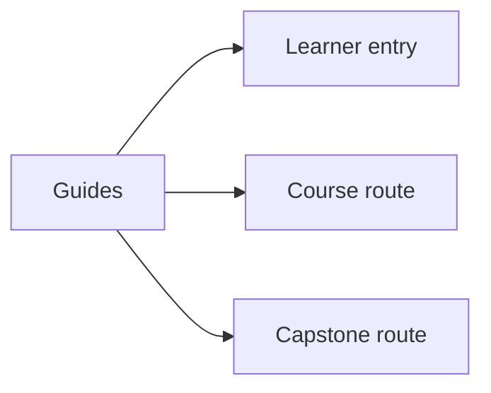
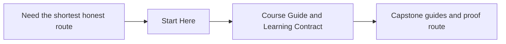

# Guides

<!-- page-maps:start -->
## Page Maps

<!-- page-maps:end -->

Use this section when you need route guidance rather than a single mechanism page. The
guides keep the reading order, proof path, and capstone bridge explicit so the modules
do not have to repeat that scaffolding.

## Pages in this section

- [Start Here](start-here.md) for the shortest honest entry path
- [Course Guide](course-guide.md) for the module arc and reading order
- [Learning Contract](learning-contract.md) for the study rules
- [Command Guide](command-guide.md) for the executable route
- [Module Dependency Map](module-dependency-map.md) and [Practice Map](practice-map.md) for study planning
- [Capstone Guide](capstone.md), [Capstone Map](capstone-map.md), and [Capstone File Guide](capstone-file-guide.md) for the code-reading route
