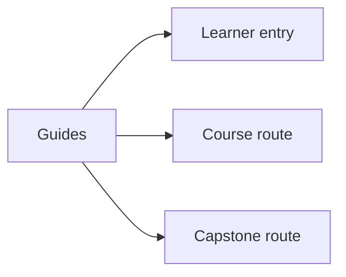
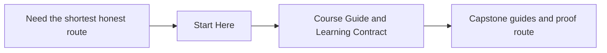

# Guides

<!-- page-maps:start -->
## Page Maps

<!-- page-maps:end -->

Use this section when you need route guidance rather than a single mechanism page. The
guides keep the reading order, proof path, and capstone bridge explicit so the modules
do not have to repeat that scaffolding.

## Read These First

- [Start Here](start-here.md) for the shortest honest entry route
- [Course Guide](course-guide.md) for the module arc and support-page roles
- [Learning Contract](learning-contract.md) for the teaching bar and review expectations
- [Module 00: Orientation](../module-00-orientation/index.md) for the course shape
- [Runtime Power Ladder](../reference/runtime-power-ladder.md) for the governing review model

## Use These For Study Planning

- [Reading Routes](reading-routes.md) when you want a paced path through dense modules
- [Module Dependency Map](module-dependency-map.md) when you need the sequence explained
- [Practice Map](practice-map.md) when you want the module-to-proof loop in one place

## Use These For Commands And Proof

- [Command Guide](command-guide.md) for the executable route
- [Review Checklist](../reference/review-checklist.md) when you need the stable review bar
- [Runtime Glossary](../reference/runtime-glossary.md) when the vocabulary itself is the blocker

## Use These For Capstone Reading

- [Capstone Guide](capstone.md) for the capstone’s role in the course
- [Capstone Map](capstone-map.md) for the module-to-repository route
- [Capstone File Guide](capstone-file-guide.md) for file responsibilities
- [Capstone Proof Checklist](capstone-proof-checklist.md) for a bounded proof pass
- [Capstone Review Worksheet](capstone-review-worksheet.md) for structured repository review
- [Capstone Extension Guide](capstone-extension-guide.md) for safe evolution

## Keep The Layout Stable

- `index.md` stays the course home
- `guides/` stays the learner route and proof shelf
- `reference/` stays the durable runtime and review shelf
- `module-00-orientation/` plus Modules `01` to `10` stay the teaching arc
