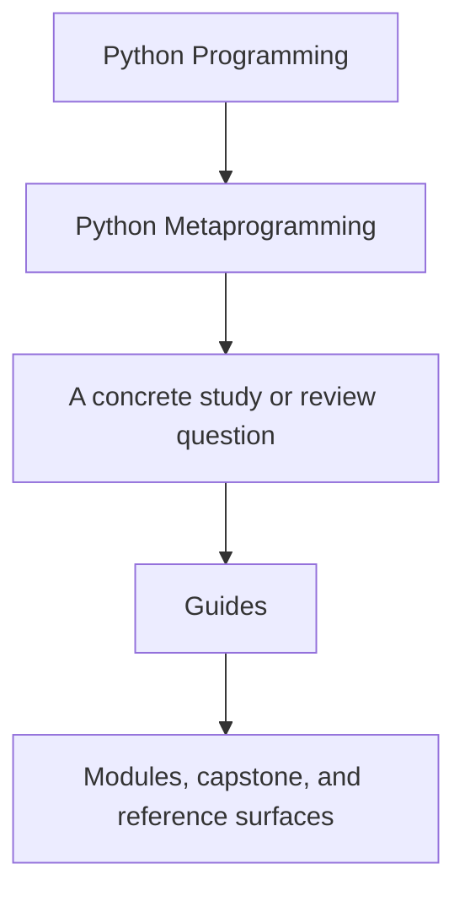
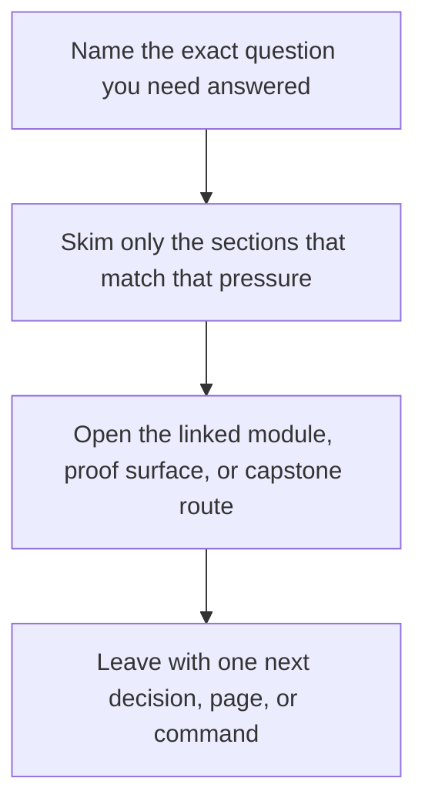

# Guides

<!-- page-maps:start -->
## Guide Fit

<!-- page-maps:end -->

Read the first diagram as a timing map: this guide is for a named pressure, not for wandering the whole course-book. Read the second diagram as the guide loop: arrive with a concrete question, use only the matching sections, then leave with one smaller and more honest next move.

Use this section when you need route guidance rather than a single mechanism page. The
guides keep the reading order, proof path, and capstone bridge explicit so the modules
do not have to repeat that scaffolding.

## Choose one lane

| If your pressure is... | Best page | Then go to... |
| --- | --- | --- |
| I need the shortest honest entry route. | [Start Here](start-here.md) | [Course Guide](course-guide.md) |
| I need the module arc and review bar kept explicit. | [Course Guide](course-guide.md) | [Learning Contract](learning-contract.md) |
| I need to choose a mechanism without skipping lower-power tools. | [Pressure Routes](pressure-routes.md) | [Review Checklist](../reference/review-checklist.md) |
| I need to know what each module is supposed to change. | [Module Promise Map](module-promise-map.md) | [Module Checkpoints](module-checkpoints.md) |
| I need to route a runtime claim to evidence. | [Proof Matrix](proof-matrix.md) | [Proof Ladder](proof-ladder.md) |
| The capstone runtime still feels unfamiliar. | [Start Here](start-here.md) | [Capstone](../capstone/index.md) |
| I am resuming after a break. | [Mid-Course Map](../module-00-orientation/mid-course-map.md) | [Proof Ladder](proof-ladder.md) |

## Use the shelf by job

| Job | Best page |
| --- | --- |
| understand the module arc and support-page roles | [Course Guide](course-guide.md) |
| see the sequence justified | [Module Dependency Map](../reference/module-dependency-map.md) |
| rehearse the module-to-proof loop | [Practice Map](../reference/practice-map.md) |
| route mechanism choice through the stable review bar | [Review Checklist](../reference/review-checklist.md) |
| sharpen a keep, change, or reject decision | [Boundary Review Prompts](../reference/boundary-review-prompts.md) |
| spot smells before you can name the mechanism | [Anti-Pattern Atlas](../reference/anti-pattern-atlas.md) |
| keep scope boundaries explicit | [Topic Boundaries](../reference/topic-boundaries.md) |
| route a claim to executable evidence | [Proof Matrix](proof-matrix.md) |
| choose the smallest honest proof route | [Proof Ladder](proof-ladder.md) |
| confirm the local environment before public commands | [Platform Setup](platform-setup.md) |

## Cross into the capstone deliberately

| If you need... | Best page |
| --- | --- |
| the capstone's role in the course | [Capstone](../capstone/index.md) |
| the module-to-repository route | [Capstone Map](../capstone/capstone-map.md) |
| a bounded first pass through commands and files | [Capstone Walkthrough](../capstone/capstone-walkthrough.md) |
| ownership boundaries inside the runtime | [Capstone Architecture Guide](../capstone/capstone-architecture-guide.md) |
| file responsibilities inside the repository | [Capstone File Guide](../capstone/capstone-file-guide.md) |
| a bounded proof pass | [Capstone Proof Guide](../capstone/capstone-proof-guide.md) |
| structured repository review | [Capstone Review Worksheet](../capstone/capstone-review-worksheet.md) |
| safe evolution | [Capstone Extension Guide](../capstone/capstone-extension-guide.md) |

## Good use of this shelf

- Open one route guide first, not three at once.
- Move to reference pages when the question becomes a standard or boundary call.
- Move to capstone pages only after you know which module claim you want to inspect.
- Stop once one page has given you a clear next module, proof route, or review decision.

## Keep The Layout Stable

- `index.md` stays the course home
- `guides/` stays the study route and proof shelf
- `capstone/` stays the capstone-specific reading, proof, and review shelf
- `reference/` stays the durable runtime and review shelf
- `module-00-orientation/` plus Modules `01` to `10` stay the teaching arc

## Directory glossary

Use [Glossary](../reference/glossary.md) when you want the recurring language in this shelf kept stable while you move between study routes, proof routes, and support pages.
