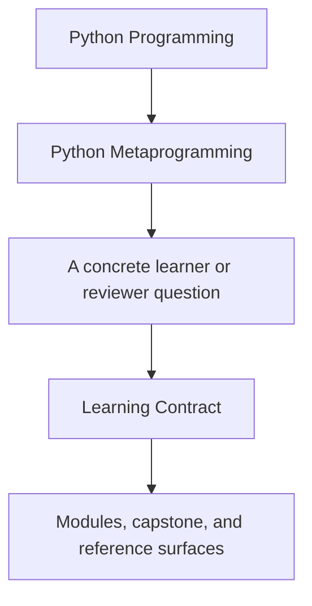
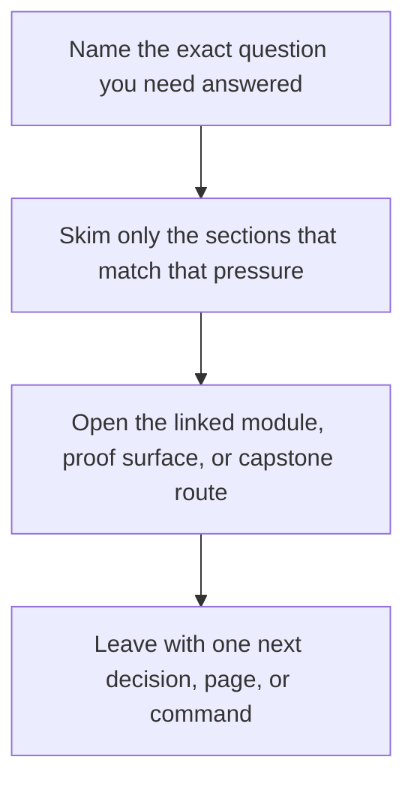

# Learning Contract

<!-- page-maps:start -->
## Guide Fit

<!-- page-maps:end -->

Read the first diagram as a timing map: this guide is for a named pressure, not for wandering the whole course-book. Read the second diagram as the guide loop: arrive with a concrete question, use only the matching sections, then leave with one smaller and more honest next move.

This course only works if you treat it as a judgment-building program instead of a bag
of runtime tricks. The contract below is the minimum discipline required to get that
value out of it.

## Non-negotiable study rules

1. Read the course in order from [Module 00](../module-00-orientation/index.md) to [Module 10](../module-10-runtime-governance-and-mastery/index.md), then close with [Mastery Review](../module-10-runtime-governance-and-mastery/mastery-review.md).
2. Keep the [Capstone Guide](capstone.md) and [Capstone Map](capstone-map.md) open while reading.
3. After every module, identify the lower-power alternative that would solve some of the same problems.
4. Do not copy a pattern into production code until you can explain its debugging cost.

## Questions you should always answer

- What happens at import time, class-definition time, instance time, or call time?
- Which metadata or invariants must remain visible after transformation?
- Which part of the behavior belongs on an object, a field, a wrapper, or a class?
- What would become harder to test or review if this code became more magical?

## Evidence rule

Every major claim in the course should be checkable in either:

- one runnable code fence in the module
- one named capstone file
- one capstone proof command

If you cannot check the claim, treat it as untrusted until you can.

## When to slow down

Slow down immediately if:

- decorators start feeling interchangeable with descriptors
- metaclasses feel exciting instead of narrowly justified
- `eval`, import hooks, or monkey-patching stop sounding dangerous

Those moments usually mean the earlier conceptual boundary is not firm yet.
