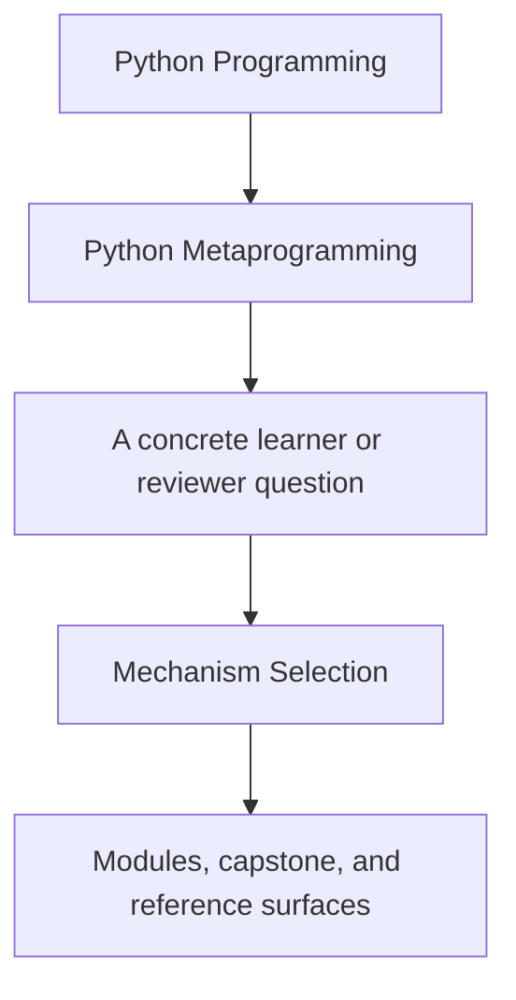
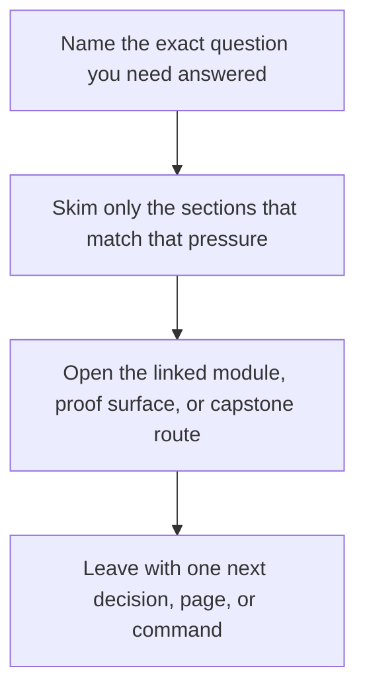

# Mechanism Selection

<!-- page-maps:start -->
## Guide Fit

<!-- page-maps:end -->

Read the first diagram as a timing map: this guide is for a named pressure, not for wandering the whole course-book. Read the second diagram as the guide loop: arrive with a concrete question, use only the matching sections, then leave with one smaller and more honest next move.

Use this page when you know the runtime problem but are still deciding which mechanism
should own it.

The rule is simple: choose the lowest-power mechanism that can own the invariant without
hiding where the behavior lives.

## Decision Table

| If the real problem is... | Prefer this | Do not jump to... | Why |
| --- | --- | --- | --- |
| observing runtime structure safely | `inspect`, `type`, `vars`, `getattr_static` | decorators or descriptors | observation should not change behavior |
| changing one callable's behavior while preserving identity | decorators with `functools.wraps` | descriptors or metaclasses | the boundary is one call surface |
| changing one class after it already exists | a class decorator | a metaclass | post-creation transformation does not need class-creation control |
| owning validation or computed behavior for one attribute | `property` or a descriptor | a class decorator or metaclass | attribute lookup is the real boundary |
| sharing field behavior across many attributes or classes | a descriptor with `__set_name__` | a metaclass | the behavior still belongs to attribute access, not class creation |
| enforcing a rule while the class body is being built | a metaclass with a narrow hook | global patching or import hooks | declaration-time control is the actual need |
| changing import behavior across a process | explicit imports first, then a tooling-grade import hook only if unavoidable | app-level metaclass magic | process-wide hooks are the highest blast radius tool |

## Anti-Pattern Checks

### Decorator anti-pattern

If the wrapper needs to inspect or control per-instance attribute storage, the problem is
probably not a decorator problem anymore.

### Class decorator anti-pattern

If you keep injecting descriptors or fighting inheritance rules after class creation, you
are probably compensating for an ownership mistake.

### Descriptor anti-pattern

If the logic has nothing to do with attribute access and only needs an explicit method
call, a descriptor will make the design harder to read.

### Metaclass anti-pattern

If you cannot explain why the rule must run before the class exists, the metaclass is
likely hiding a lower-power design.

## Review Questions

- What lower-power tool almost worked?
- What exact boundary does the chosen mechanism own?
- What would be misleading about using the next higher-power tool?
- What capstone file or proof route demonstrates that the mechanism stayed honest?

## Good Escalation Examples

- Wrapper timing and retries stay with decorators because the change belongs to call boundaries.
- Reusable field validation moves to descriptors because lookup and storage rules matter.
- Declaration-time plugin registration reaches a metaclass only when subclass-wide class-creation rules are the point.

## Bad Escalation Examples

- Using a metaclass only to populate a registry that an explicit decorator could fill.
- Using a descriptor to hide expensive remote I/O when an explicit method would make the cost visible.
- Using a class decorator to retrofit behavior that should have been a normal helper function.
