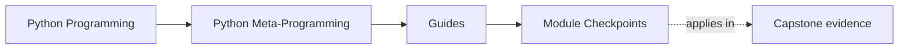

# Module Checkpoints

<!-- page-maps:start -->
## Page Maps

<!-- page-maps:end -->

Read the first diagram as a timing map: this guide is for a named pressure, not for
wandering the whole course-book. Read the second diagram as the guide loop: arrive with
a concrete question, use only the matching sections, then leave with one smaller and
more honest next move.

Use this page at the end of each module. A strong metaprogramming course needs a clear
exit bar, not just more mechanism pages. These checkpoints are the smallest honest claims
you should be able to make before moving deeper into the course.

## Checkpoints by module

### Module 01: Runtime Objects and the Python Object Model

- You can explain what Python functions, classes, modules, and instances are as runtime objects rather than as syntax alone.
- You can distinguish supported introspection from diagnostic-only CPython surfaces.
- You can describe what actually happens when names resolve to objects, methods, or closures.
- Prove it by explaining one capstone object from `src/incident_plugins/` without running its business behavior.

### Module 02: Safe Runtime Observation and Inspection

- You can explain why attribute access is not automatically passive.
- You can separate visible names, stored state, and resolved values.
- You can choose safer observation tools before resorting to risky value resolution.
- Prove it by inspecting the capstone manifest and registry output before opening implementation files.

### Module 03: Signatures, Provenance, and Runtime Evidence

- You can use signatures to explain how a callable should be invoked.
- You can distinguish strong runtime evidence from best-effort provenance helpers.
- You can explain why `inspect.getattr_static` and `inspect.getmembers` answer different questions.
- Prove it by reading the capstone action signatures and describing what they reveal without invocation.

### Module 04: Function Wrappers and Transparent Decorators

- You can describe what runs at definition time and what runs at call time inside a decorator.
- You can explain why `functools.wraps` is part of correctness rather than style.
- You can tell when a wrapper is still transparent and when it has started changing semantics in a hidden way.
- Prove it by inspecting `src/incident_plugins/actions.py` and the runtime tests for invocation recording.

### Module 05: Decorator Design, Policies, and Typing

- You can judge whether policy belongs in a decorator or in an explicit object or service boundary.
- You can explain what annotation-driven runtime behavior can and cannot promise honestly.
- You can describe the review cost of retries, validation, or caching when they are hidden behind wrappers.
- Prove it by comparing the capstone action decorator with one policy-heavy pattern from the module and naming why the capstone stays narrower.

### Module 06: Class Customization Before Metaclasses

- You can explain when a class decorator, property, or explicit helper is enough.
- You can describe why post-creation class customization is lower-risk than class-creation control.
- You can recognize when a design is already drifting toward descriptor or metaclass territory.
- Prove it by inspecting constructor behavior and class-level customization inside the capstone without yet reaching for `PluginMeta`.

### Module 07: Descriptors, Lookup, and Attribute Control

- You can explain the difference between data and non-data descriptors.
- You can trace one attribute from class declaration to per-instance storage.
- You can justify when a descriptor owns the invariant better than a plain method or property.
- Prove it by inspecting `src/incident_plugins/fields.py` and the field tests for coercion and storage behavior.

### Module 08: Descriptor Systems, Validation, and Framework Design

- You can say when a descriptor is still one field contract and when it has become framework architecture.
- You can explain how caching, coercion, or external storage change the review cost of a field abstraction.
- You can describe why some validation belongs at assignment while other validation belongs elsewhere.
- Prove it by comparing the capstone field system with the richer descriptor patterns from the module and naming which extra powers were intentionally left out.

### Module 09: Metaclass Design and Class Creation

- You can explain what must happen before the class exists for a metaclass to be justified.
- You can compare a metaclass honestly against class decorators and explicit registration.
- You can describe why deterministic, resettable registration matters in tests.
- Prove it by inspecting `src/incident_plugins/framework.py` and `tests/test_registry.py`.

### Module 10: Runtime Governance and Mastery Review

- You can name the red lines around dynamic execution, monkey-patching, and import-hook behavior.
- You can explain which runtime powers may be acceptable in tooling but not in ordinary application code.
- You can review a meta-heavy design for debuggability, observability, and reversibility.
- Prove it by using the capstone proof route and naming one design change you would reject as making the runtime less observable.

## How to use these checkpoints

- If you cannot explain the checkpoint in plain language, re-read the module overview before going deeper.
- If the checkpoint only feels true in prose, inspect the named capstone surface so the claim becomes concrete.
- If a later module feels magical again, come back here and find the earliest checkpoint that is still fuzzy.

These checkpoints turn the course from "many advanced runtime pages" into a sequence of
earned review abilities.
