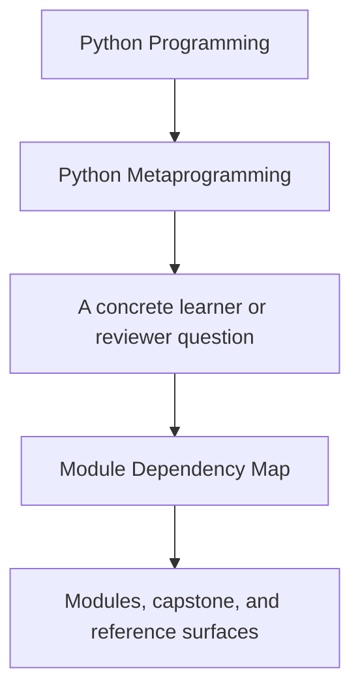
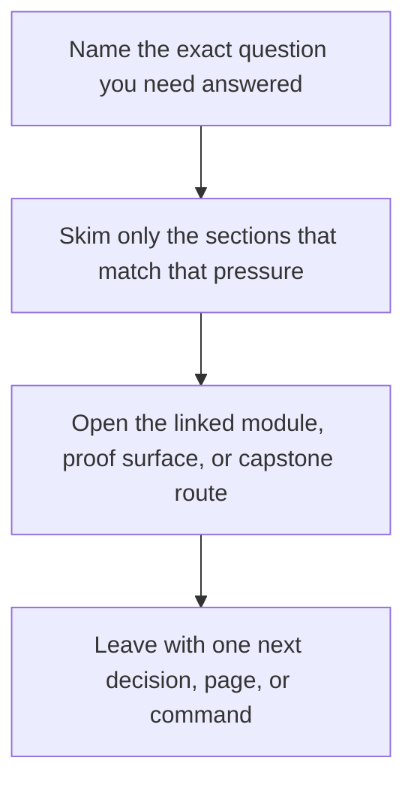

# Module Dependency Map

<!-- page-maps:start -->
## Guide Fit

<!-- page-maps:end -->

Read the first diagram as a timing map: this guide is for a named pressure, not for wandering the whole course-book. Read the second diagram as the guide loop: arrive with a concrete question, use only the matching sections, then leave with one smaller and more honest next move.

This map exists so learners can see which concepts are prerequisites and which are
parallel reinforcements. Metaprogramming becomes clumsy when later mechanisms are learned
before earlier boundaries are stable.

## Dependency logic

- [Module 01](../module-01-runtime-objects-object-model/index.md) and [Module 02](../module-02-runtime-observation-inspection/index.md) teach the object and namespace model.
- [Module 03](../module-03-signatures-provenance-runtime-evidence/index.md) turns inspection into a verification tool instead of passive curiosity.
- [Modules 04-06](../module-04-function-wrappers-transparent-decorators/index.md) through [module-06-class-customization-pre-metaclasses/index.md](../module-06-class-customization-pre-metaclasses/index.md) move from function wrappers to class-level transformation.
- [Modules 07-08](../module-07-descriptors-lookup-attribute-control/index.md) through [module-08-descriptor-systems-validation-framework-design/index.md](../module-08-descriptor-systems-validation-framework-design/index.md) explain attribute control as a first-class design surface.
- [Module 09](../module-09-metaclass-design-class-creation/index.md) only makes sense after the learner can compare it to descriptors and class decorators.
- [Module 10](../module-10-runtime-governance-mastery-review/index.md) and [Mastery Review](../module-10-runtime-governance-mastery-review/mastery-review.md) turn mechanics into review judgment.

## Safe skip rules

- You may skim Module 05 on a first pass if decorator basics are already solid.
- You should not skip Module 07 before reading Module 09.
- You should not treat Module 10 as optional; it is the boundary that keeps the earlier modules honest.

## Recovery rule

If a later module starts feeling magical again, return to the previous mechanism on the
ladder and restate what it can and cannot own.
