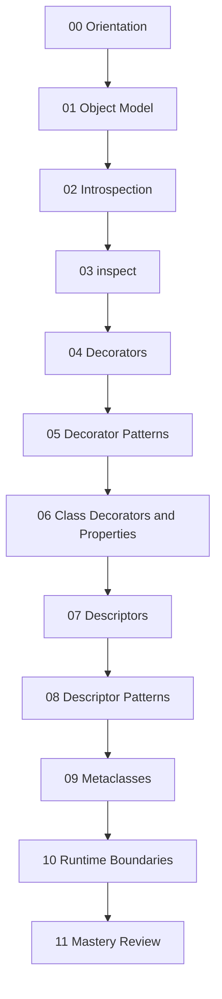
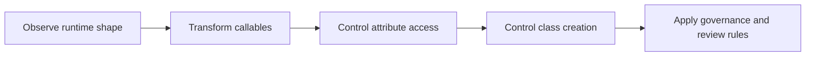

# Module Dependency Map

<!-- page-maps:start -->
## Page Maps

<!-- page-maps:end -->

This map exists so learners can see which concepts are prerequisites and which are
parallel reinforcements. Metaprogramming becomes clumsy when later mechanisms are learned
before earlier boundaries are stable.

## Dependency logic

- [Module 01](../module-01.md) and [Module 02](../module-02.md) teach the object and namespace model.
- [Module 03](../module-03.md) turns inspection into a verification tool instead of passive curiosity.
- [Modules 04-06](../module-04.md) through [module-06.md](../module-06.md) move from function wrappers to class-level transformation.
- [Modules 07-08](../module-07.md) through [module-08.md](../module-08.md) explain attribute control as a first-class design surface.
- [Module 09](../module-09.md) only makes sense after the learner can compare it to descriptors and class decorators.
- [Modules 10-11](../module-10.md) through [module-11.md](../module-11.md) turn mechanics into review judgment.

## Safe skip rules

- You may skim Module 05 on a first pass if decorator basics are already solid.
- You should not skip Module 07 before reading Module 09.
- You should not treat Module 10 as optional; it is the boundary that keeps the earlier modules honest.

## Recovery rule

If a later module starts feeling magical again, return to the previous mechanism on the
ladder and restate what it can and cannot own.
