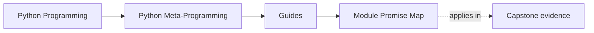
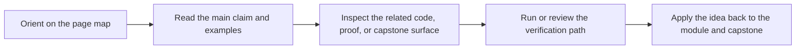

# Module Promise Map

<!-- page-maps:start -->
## Page Maps

<!-- page-maps:end -->

Read the first diagram as a timing map: this guide is for a named pressure, not for
wandering the whole course-book. Read the second diagram as the guide loop: arrive with
a concrete question, use only the matching sections, then leave with one smaller and
more honest next move.

Use this page when the table of contents feels dense and you want the exact promise of
each module in one place. A serious metaprogramming course should make clear what each
module settles, what it still leaves open, and which part of the capstone proves the claim.

## The ten-module promise spine

| Module | Main promise | Not promised yet | Capstone surface to inspect | Prepares you for |
| --- | --- | --- | --- | --- |
| 01 Runtime Object Model | you can explain what Python functions, classes, modules, and instances are as runtime objects | safe inspection and evidence gathering | module and callable structure visible through `src/incident_plugins/` and manifest output | safe observation |
| 02 Safe Runtime Observation | you can inspect names, storage, types, and callability without pretending all inspection is passive | signature-driven evidence and provenance | manifest and registry outputs before reading implementation details | structured introspection |
| 03 Signatures and Provenance | you can turn runtime observation into reliable callable and source evidence | behavior-changing wrappers and policy-heavy decoration | action signatures and exported runtime facts | wrapper discipline |
| 04 Transparent Decorators | you can explain what a wrapper changes at definition time and at call time without losing callable identity | policy-heavy decorators and typing-aware wrapper design | action decorators in `actions.py` plus runtime tests | decorator policy design |
| 05 Decorator Policies and Typing | you can judge where decorator-carried policy stays honest and where it should become an explicit object or service | class-level customization and attribute ownership | wrapper tests, manifest behavior, and action metadata | class customization before metaclasses |
| 06 Class Customization Before Metaclasses | you can compare class decorators, properties, and explicit helpers before escalating to stronger hooks | descriptor lookup precedence and reusable field systems | constructor shape and class-level customization around plugins | descriptor mechanics |
| 07 Descriptors and Lookup | you can explain attribute lookup, descriptor precedence, and per-instance storage without folklore | framework-shaped descriptor systems and wider validation architecture | `fields.py` and tests that prove storage and coercion behavior | descriptor systems |
| 08 Descriptor Systems and Validation | you can judge when a descriptor is still one field contract and when it has become a framework boundary | class-creation control and metaclass scope | field schema export and validation surfaces inside the plugin runtime | metaclass justification |
| 09 Metaclass Design and Class Creation | you can explain what must happen during class creation and reject metaclasses that merely hide lower-power options | governance, red lines, and organization-level runtime policy | `framework.py`, registry tests, and constructor generation | runtime governance |
| 10 Runtime Governance and Mastery Review | you can review metaprogramming with explicit red lines around debuggability, global hooks, and dynamic execution | no later module; this is the integrated review pass | manifest export, deterministic registration, and the full proof route | long-term stewardship |

## The three arcs inside the course

### Observation arc

Modules 01 to 03 answer:

- what exists at runtime
- how to inspect it safely
- which observations are strong enough to support tooling and review

If these are weak, later modules feel magical instead of mechanical.

### Control arc

Modules 04 to 09 answer:

- what behavior belongs to call boundaries
- what behavior belongs to attribute access
- what behavior truly belongs to class creation

If these are weak, higher-power mechanisms start solving the wrong problems.

### Governance arc

Module 10 answers:

- which runtime powers are still defensible
- which ones should trigger immediate review skepticism
- what makes a dynamic design maintainable rather than merely impressive

If this is weak, the rest of the course can still teach mechanisms while failing to teach judgment.

## How to use this map well

- Read the module promise before reading the module overview.
- Use "not promised yet" to avoid expecting later modules too early.
- Use "capstone surface to inspect" to keep the module promise tied to one executable place in the repository.
- Use "prepares you for" to understand why the reading order matters.

The promise map keeps the course from reading like a heap of advanced runtime tricks. It
makes the book read like one argument about evidence, ownership, and restraint.
