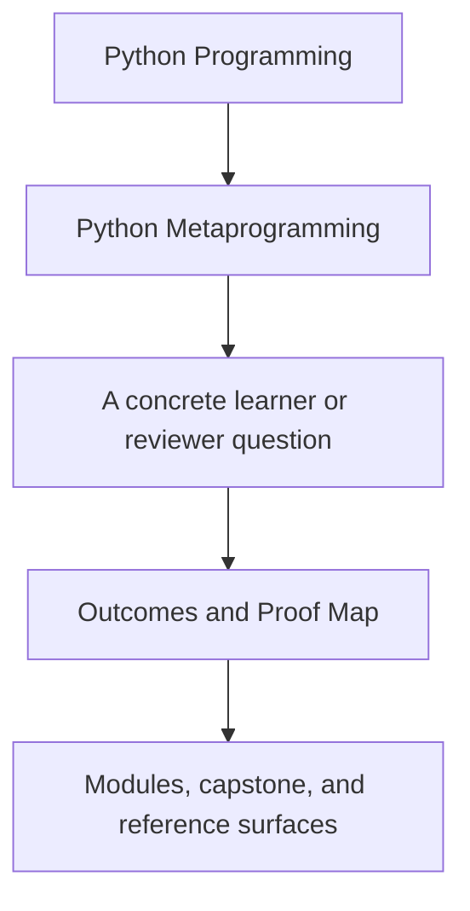
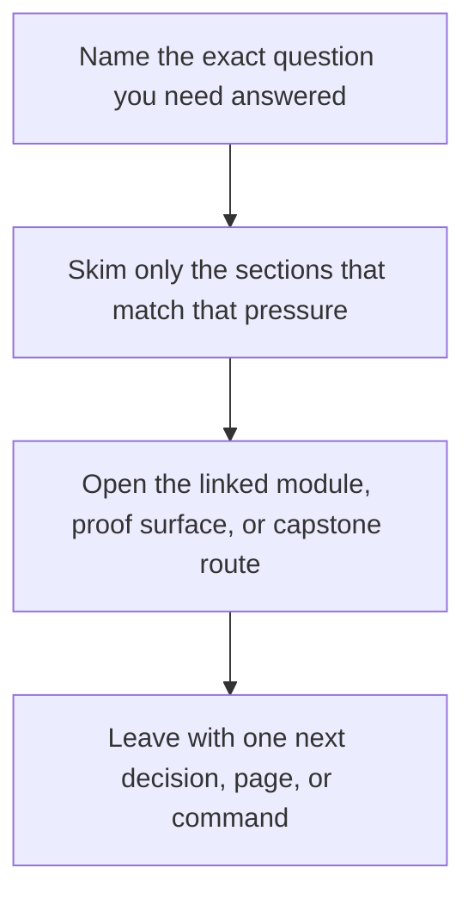

# Outcomes and Proof Map

<!-- page-maps:start -->
## Guide Fit

<!-- page-maps:end -->

Read the first diagram as a timing map: this guide is for a named pressure, not for
wandering the whole course-book. Read the second diagram as the guide loop: arrive with
a concrete question, use only the matching sections, then leave with one smaller and
more honest next move.

Use this page when you want the course contract written out explicitly: what the learner
should become able to do, what work builds that ability, and what repository surface
proves it honestly enough to review.

## Start from the missing ability

If one outcome still feels weak, do not reread the whole course. Start with the row for
that missing ability, then follow only its first route and primary capstone evidence.

## Alignment map

| Course outcome | Main learning activities | Primary capstone evidence | Best first route |
| --- | --- | --- | --- |
| explain what happens at import time, class-definition time, instance time, and call time | Modules 01, 02, and 09; course map; first-contact map | `framework.py`, `plugins.py`, manifest output, registry output | [First-Contact Map](../module-00-orientation/first-contact-map.md) |
| inspect runtime behavior without accidentally executing the wrong thing | Modules 02 and 03; practice map; proof ladder | `make manifest`, `make registry`, manifest and signatures output | [Proof Ladder](proof-ladder.md) |
| preserve signatures, provenance, and reviewability when wrapping callables | Modules 03, 04, and 05; capstone walkthrough; command guide | `actions.py`, `make action`, `make trace`, `tests/test_runtime.py` | [Capstone Walkthrough](../capstone/capstone-walkthrough.md) |
| choose honestly between plain code, decorators, descriptors, class decorators, and metaclasses | Modules 06 to 09; mechanism selection; anti-pattern atlas | `fields.py`, `framework.py`, `make field`, `make registry`, registry tests | [Mechanism Selection](mechanism-selection.md) |
| review meta-heavy code for hidden state, global hooks, and unjustified runtime power | Module 10; mastery map; review checklist; topic boundaries | `make verify-report`, `make proof`, `tests/test_registry.py`, public manifest and trace evidence | [Mastery Map](../module-00-orientation/mastery-map.md) |

## What counts as learning activity here

The course is aligned around three repeated actions:

- read the module until the design claim is legible
- inspect the matching code or public output so the claim becomes concrete
- use a proof or review route to decide whether the claim is actually supported

If any one of those is missing, the learner may still remember vocabulary but the course
has not finished its job.

## Module arc by evidence shape

| Module range | Main learner move | Main evidence shape |
| --- | --- | --- |
| Modules 01 to 03 | learn what exists at runtime and what can be observed safely | manifest output, signature output, careful inspection surfaces |
| Modules 04 to 06 | compare callable transformation with lower-power class customization | wrapper outputs, runtime tests, constructor behavior |
| Modules 07 to 09 | place ownership at attribute or class-creation boundaries deliberately | field outputs, registry outputs, field and registry tests |
| Module 10 and mastery review | turn mechanism knowledge into review judgment | verification bundles, review checklist, anti-pattern routing |

## Honest review rule

When a learner says "I understood this course claim," the next useful question is:

> Which capstone surface proves that the understanding changed your judgment?

If the learner cannot name the surface, the next step is usually not another page. It is
a return to the proof route.

## Good stopping point

Stop with this page once you can say:

- which outcome is currently weakest
- which activity should strengthen it next
- which capstone surface would prove that the ability is now real

## Best companion pages

- [Course Guide](course-guide.md)
- [Practice Map](practice-map.md)
- [Capstone Map](../capstone/capstone-map.md)
- [Capstone Review Worksheet](../capstone/capstone-review-worksheet.md)
