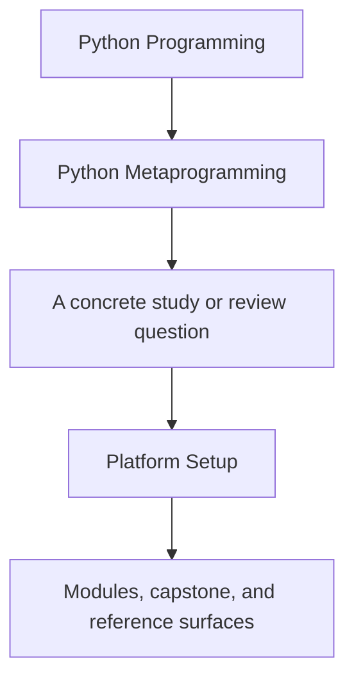
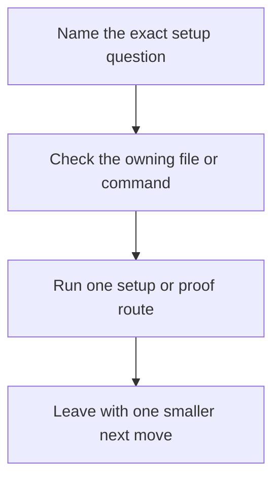

# Platform Setup

<!-- page-maps:start -->
## Guide Fit




<!-- page-maps:end -->

Read the first diagram as a timing map: this page exists for setup pressure, not for
wandering the runtime ladder. Read the second diagram as the setup loop: check the owning
surface, run one route, then stop once the environment contract is visible.

Python Metaprogramming depends on a reviewable runtime surface. That means the local
environment must be boring and explicit before decorators, descriptors, or metaclasses
are allowed to look interesting.

## Minimum tooling

You need:

- Python 3.10 or newer
- Git on the command line
- a writable local filesystem for `artifacts/`
- the capstone-managed virtual environment created through `make install`

## Supported toolchain contract

Use these as the authoritative setup surfaces:

| Surface | What it tells you |
| --- | --- |
| `capstone/pyproject.toml` | supported Python floor |
| `capstone/Makefile` `install` target | how the supported environment is built |
| `capstone/Makefile` public commands | which review routes exist once the environment is ready |
| [Command Guide](../capstone/command-guide.md) | when to use each public command |

The support promise is tied to the capstone-managed virtual environment, not to a
system-wide Python that happened to have `pytest` installed already.

## Repository-root setup

From the repository root:

```bash
make PROGRAM=python-programming/python-meta-programming docs-build
make PROGRAM=python-programming/python-meta-programming test
make PROGRAM=python-programming/python-meta-programming capstone-manifest
```

Use `test` to build the supported capstone environment and run the executable suite.
Use `capstone-manifest` only after setup is stable and the question is about public
runtime shape rather than installation.

## Capstone setup

From `capstone/`:

```bash
make install
make test
make manifest
make inspect
```

That sequence creates the virtual environment, installs the editable package plus pytest,
checks the suite, and then produces the smallest honest public-shape and bundle routes.

## What to verify before deeper proof

Check these in order:

1. `make install` completes and creates the virtual environment under `artifacts/venv/...`.
2. `make test` passes before you trust any saved bundle.
3. `make manifest` and `make registry` render public output without import-time surprises.
4. `make inspect` writes the guided inspection bundle.

If step 2 fails, do not escalate to `proof` yet. Fix the environment or the executable
suite first.

## Common setup failures

| Symptom | Likely cause | Fix |
| --- | --- | --- |
| `venv` creation fails | unsupported Python on the path | install Python 3.10+ and rerun `make install` |
| `incident_plugins` import errors during tests | editable install missing from the virtual environment | rerun `make install` inside `capstone/` |
| public commands work in one shell but not another | global Python and capstone virtual environment are mixed | use the documented Make targets instead of direct global commands |
| saved bundles do not appear under `artifacts/` | route run from the wrong directory or stale environment | rerun the documented route from the repository root or `capstone/` exactly |

## Drift signals

Treat these as reasons to re-check the setup contract:

- Python changed locally and the capstone virtual environment was not recreated
- tests pass, but `manifest` or `registry` fail from the documented routes
- the command list in [Command Guide](../capstone/command-guide.md) no longer matches the Makefile
- a global package install changes behavior that the capstone environment did not request

## What this page does not promise

- It does not promise support for arbitrary global installs outside the capstone
  environment.
- It does not treat “the CLI rendered once” as enough; the executable suite is still the
  real setup bar.
- It does not replace [Proof Ladder](proof-ladder.md) when the question is route sizing
  rather than environment stability.
