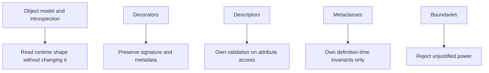

# Practice Map

<!-- page-maps:start -->
## Page Maps

<!-- page-maps:end -->

Use this page to turn reading into deliberate practice. The course is strongest when
each concept is followed by one small proof, one capstone inspection, and one review
question.

## Practice loops by stage

### Modules 01-03

- print runtime identities, signatures, and namespaces
- explain what the inspection shows and what it does not guarantee

### Modules 04-06

- wrap one function and check whether signature, name, and docstring survive
- compare a function decorator, class decorator, and `@property` solution to the same problem

### Modules 07-08

- trace one attribute from descriptor declaration to per-instance storage
- identify whether validation happens at assignment, at construction, or too late

### Modules 09-10 and Mastery Review

- identify one invariant that truly belongs at class creation time
- reject at least one metaclass idea as better solved by a lower-power mechanism
- review one design choice for debuggability, security, and test isolation

## Capstone checkpoints

- read the manifest before invoking any plugin
- inspect the field schema before reading one descriptor implementation
- inspect the registry before reading the metaclass
- run the proof route after changing one configuration value
