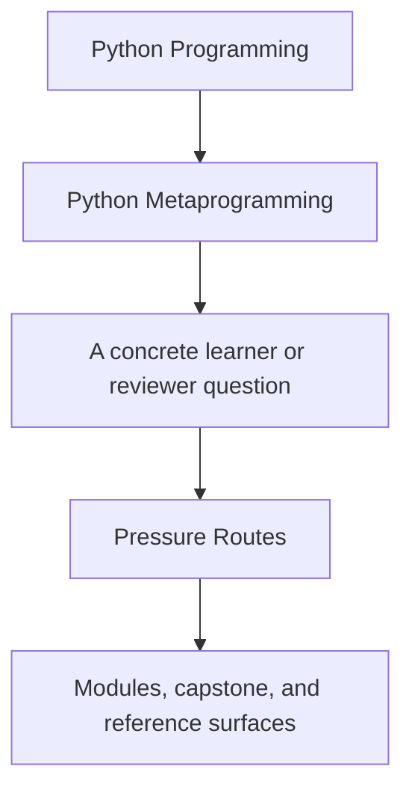
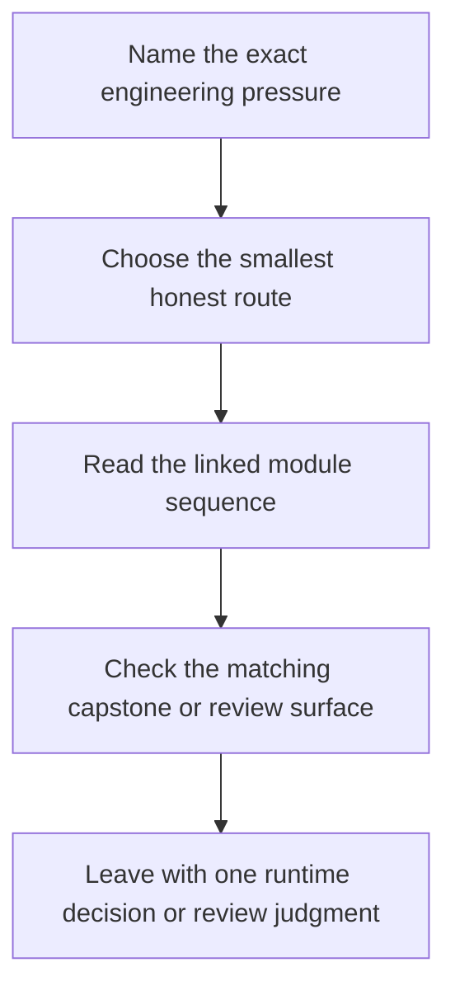

# Pressure Routes

<!-- page-maps:start -->
## Guide Fit

<!-- page-maps:end -->

Read the first diagram as a timing map: this guide is for a named engineering pressure,
not for wandering the whole course-book. Read the second diagram as the route loop:
choose the smallest honest route, study the linked mechanism pages, then leave with one
concrete design or review decision.

Use this page when you are entering the course from a real code review, framework change,
or debugging problem instead of from a full front-to-back reading plan.

## Route 1: Review a Wrapper Without Losing Provenance

Use this when the immediate pressure is decorator-heavy code that may be hiding the callable it wrapped.

1. Read [Runtime Power Ladder](../reference/runtime-power-ladder.md).
2. Read [Module 03](../module-03-signatures-provenance-runtime-evidence/index.md) for signatures, provenance, and evidence boundaries.
3. Read [Module 04](../module-04-function-wrappers-transparent-decorators/index.md) for transparent wrapper mechanics.
4. Read [Module 05](../module-05-decorator-design-policies-typing/index.md) for policy-heavy wrappers and where they stop being honest.
5. Cross-check [Capstone Guide](capstone.md) and `capstone/src/incident_plugins/actions.py`.

Use this route when the core question sounds like:

- Did this decorator preserve the original callable's signature and metadata?
- Is this wrapper still a function transformation, or is it secretly a runtime policy layer?
- Would a small explicit object be easier to review than another decorator?

## Route 2: Untangle Attribute Validation and Field Ownership

Use this when the real confusion is around properties, descriptors, validation, or per-instance storage.

1. Read [Module 06](../module-06-class-customization-pre-metaclasses/index.md) for class decorators, properties, and lower-power alternatives.
2. Read [Module 07](../module-07-descriptors-lookup-attribute-control/index.md) for descriptor lookup and precedence.
3. Read [Module 08](../module-08-descriptor-systems-validation-framework-design/index.md) for framework-shaped field systems and their limits.
4. Keep [Mechanism Selection](mechanism-selection.md) open while reading.
5. Cross-check [Capstone Map](capstone-map.md) and `capstone/src/incident_plugins/fields.py`.

Use this route when the core question sounds like:

- Does this invariant belong to attribute access, or should it stay explicit?
- Why is one field shadowable while another always wins over instance state?
- Is this descriptor still a field contract, or has it become a hidden framework?

## Route 3: Decide Whether a Metaclass Is Actually Justified

Use this when a design is proposing class-creation hooks, registries, or import-time behavior.

1. Read [Module 06](../module-06-class-customization-pre-metaclasses/index.md) to revisit lower-power class customization.
2. Read [Module 09](../module-09-metaclass-design-class-creation/index.md) for class-creation timing and metaclass scope.
3. Read [Module 10](../module-10-runtime-governance-mastery-review/index.md) for red lines and review policy.
4. Keep [Review Checklist](../reference/review-checklist.md) and [Mechanism Selection](mechanism-selection.md) open.
5. Cross-check `capstone/src/incident_plugins/framework.py` and `capstone/tests/test_registry.py`.

Use this route when the core question sounds like:

- What must happen before the class exists?
- Could a class decorator or explicit registration function own this more honestly?
- Is the metaclass deterministic, resettable in tests, and easy to inspect?

## Route 4: Inherit a Dynamic Codebase Without Trusting Its Magic

Use this when the code already exists and you need a reliable order for inspection.

1. Read [Start Here](start-here.md) and [Course Guide](course-guide.md).
2. Read [Module 00](../module-00-orientation/index.md) for the power ladder and study stance.
3. Read [Module 02](../module-02-runtime-observation-inspection/index.md) and [Module 03](../module-03-signatures-provenance-runtime-evidence/index.md) before touching higher-power hooks.
4. Read [Module 07](../module-07-descriptors-lookup-attribute-control/index.md) and [Module 09](../module-09-metaclass-design-class-creation/index.md) once the observation layer is stable.
5. Finish with [Module 10](../module-10-runtime-governance-mastery-review/index.md) and [Capstone Review Worksheet](capstone-review-worksheet.md).

Use this route when the core question sounds like:

- Where does this system execute code during inspection?
- Which dynamic behaviors happen at import time instead of call time?
- Which parts of this design should stay, and which parts should be redesigned downward?

## Route 5: Build a Small Framework Without Teaching the Wrong Lesson

Use this when you are authoring library code and need the design to stay inspectable for future maintainers.

1. Read [Module 01](../module-01-runtime-objects-object-model/index.md) through [Module 03](../module-03-signatures-provenance-runtime-evidence/index.md) for the observation floor.
2. Read [Module 04](../module-04-function-wrappers-transparent-decorators/index.md) through [Module 06](../module-06-class-customization-pre-metaclasses/index.md) for lower-power customization.
3. Read [Module 07](../module-07-descriptors-lookup-attribute-control/index.md) through [Module 09](../module-09-metaclass-design-class-creation/index.md) only where the lower-power alternatives genuinely fail.
4. Keep [Mechanism Selection](mechanism-selection.md) and [Review Checklist](../reference/review-checklist.md) open while designing.
5. Cross-check [Capstone Guide](capstone.md), [Capstone Map](capstone-map.md), and the tests under `capstone/tests/`.

Use this route when the core question sounds like:

- Which mechanism owns this invariant with the smallest blast radius?
- Will a maintainer be able to inspect this behavior without executing business code?
- Does the design stay testable once multiple plugins or extension points exist?

## Success Signal

You are using these routes well if you can say, after each route:

- what runtime boundary was actually under pressure
- which lower-power tool was rejected and why
- which capstone file or proof surface confirms the decision
- what design change you would still reject as too magical
